# Kurose Ross Notes

**Checklist** 

- [x]  1.1, 1.2, 1.3, 1.4, 1.5, 1.7, 3.6.1
- [x]  2.1, 2.2, 2.4, 2.6 (partial)
- [x]  Tanenbaum 2.6.1, 2.6.2, 2.6.3, 2.6.5
- [x]  Exponential and Poisson
- [x]  2.1, 2.2, 2.4
- [x]  7.1, 7.2.1, 7.2.2, 7.3, 7.4, 7.5
- [x]  3.1, 3.2, 3.3, 3.4, 3.5, 3.6, 3.7
- [ ]  2.5,
- [x]  4.1, 4.2, 4.3, 4.4, 4.5, 4.6, 4.7
- [x]  5.1, 5.2, 5.3, 5.4, 6.3
- [x]  Appendix A Queuing Models
- **Application** (message) → Presentation → Session **→ Transport** (segment) **→ Network** (datagrams) **→ Link** (frames) **→ Physical**

## Glossary

- **end system/host:** deives hookes up to the internet and which run applications on them
- **communication links/packet switches:** devices/systems which connect and form the nwtwork of end systems
- **packet switch:** takes an arriving packet on incoming communication link and forwards it onto its outgoing communication link. In packet switching networks, no reservation but packet will have to wait if links are full
- **packet:** packages of information (including headers added by systems) that are transmitted through the network. **messages** are split into packets.
- **protocol:** format and order of messages for communicating systems. also defines what actions to take upon transmitting and receiving a message
- **access network:** network which physically connects end system to the first router (called **edge router**)
- **route/path**: sequence of communication links and packet switches traversed by a packet moving from one end system to another
- **store and forward:** source/router must receive the entire packet before transmitting it. very common
- **output buffer/output queue:** packet switches have these for attached link. If the link is busy the packet is stored in this buffer. delays related to these are called **queueing delays**
- **packet loss:** when buffer is full and packet cannot go anywhere packet loss occurs - either an existing or the arriving packet will be dropped
- **forwarding table:** map that every router has which maps between destination and outbound link. these tables are set by **routing protocols**
- **content provider networks:** Google has its own network and directly connects to IXPs and other ISPs where needed.
- **traffic intensity:** Given by La/R, where R is transmission rate, La is number of *bits* per unit time. If TI>1, queue will go to infinity, so keep TI<1.
- **media packetization delay:** Delay in VoIP because the packet needs to be filled with bits of encoded digitized speech before it is sent out.
- **instantaneous throughput:** Rate at any instant at which receiver is receiving the file
- **average throughput:** no. of bits/time taken
- **HTTP:** protocol for Web doc request and transfer
- **SMTP:** protocol for transfer of email messages
- **FTP:** protocol for file transfer
- **message:** packets of information at the application layer level
- **Malware is** software that is specifically designed to disrupt, damage, or gain unauthorized access to a computer system**.** It ****may enroll your device in a network of similarly infected devices called a **botnet**. Most of **malware** is **self replicating**. **Viruses** require user interaction while **worms** do not.
- **denial of Service (DoS)** attacks can render a network, host, etc. unusable by legitimate users. It can be a **vulnerability attack** (send a few crafted messages to a vulnerable application), **bandwidth flooding** (send so many packets to clog the target’s access link), **connection flooding** (establish a large number of half/fully open TCP connections at target host. It will stop accepting legitimate connections)
- **distributed DoS** blasts traffic at target through multiple sources so that target won’t block just one sender and be safe. It also provides higher transmission rate to clog easily.
- **packet sniffer:** passive receiver that records a copy of every packet.
- You can easily send a packet over the internet with a false source address. This is called **IP spoofing**. You can have an embedded command inside that an unsuspecting user will run. To solve this, we need **end point authentication**, ie., to verify if the message really came from the source.
- **internetting**: term used to describe the process of creating a network of networks (historical)
- **bandwidth-sensitive applications** have throughput requirements. **elastic appl.** don’t
- **Content distribution network (CDN)** companies install many geographically distributed caches throughout the Internet, localising much of its traffic.
- **PSTN (public switched telephone network)**
- **network control protocol (NCP)** was the first end to end protocol between ARPAnet end systems.
- **PoP:** a group of routers (at same location) where provider ISP connects to customer ISP. **multi-homing** is a customer ISP connecting to multiple provider ISPs.
- **IXP (Internet Exchange Point):** meeting point where multiple ISPs can **peer.** ISPs at the same level can **peer** so that comms between them happen directly without going upwards.

## Chapter 1: Introduction

- common notion: in most cases every end system will receive all messages that are moving around in its network, not only its own
- **ex:** Source send L bits to a router over a link with transmission rate R. How much time will the packet take to reach R? 
**ans.** $L/R$
- **ex.** Time taken to send one pcaket from source to destination over a path with N links each of rate R. ($⇒ N-1$ router are present). Total delay? 
**ans.** $N \times L/R$ 
take case of one router, observe time taken.
- **ex.** delay for P packets sent over a series of N links. **note:** pay attention! links are *connected by*  routers.
- **Packet switching:** Packets are sent as soon as they are available. It is up to routers to use store-and-forward transmission (which adds to delay in PS) to send each packet on its way to the destination on its own. Data cannot arrive out of order in circuit switching. In packet switching they can as they is no fixed path. It has upper limit on packet size to not allow monopolization and also transmit first packet in a long message.
- No bandwidth reservation ⇒ queuing delay. The trade-off is between guaranteed service and
wasting resources versus not guaranteeing service and not wasting resources. With packet switching, packets can be routed around dead switches ⇒ more *fault tolerant*.
- **Circuit switching:** For nearly 100 years, the circuit-switching equipment used worldwide was known as **Strowger gear** (Undertaker wife story). Basic idea: once a call has been set up, a dedicated path between both ends exists and will continue to exist until the call is finished. need to set up an end-to-end path *before* any data can be sent. Because of reserved path, no congestion, unless congestion happens before path is set up.
- **circuit switched network:** connection is reserved between two end systems. like a phone connection while on call. This connection is called a **circuit**. Transmission rate is thus a reserved fraction of total transmission capacity. (one circuit on a link is reserved, for example). Circuit in a link is implemented via FDM or TDM
- **frequency division multiplexing (FDM):** division of a link’s spectrum among connections based on frequency of the band (**bandwidth)**
- **time division multiplexing (TDM):** time -divided→ frames -divided→ time slots. Each time slot in a frame is given to a connection. In FDM every connection gets to use a frequency band constantly.
- For TDM, the transmission rate of a circuit is equal to the frame rate multiplied by the number of bits in a slot. For example, if the link transmits 8,000 frames per second and each slot consists of 8 bits, then the transmission rate of a circuit is 64 kbps.
- **ex.** how long it takes to send a file of 640,000 bits from Host A to Host B over a circuit-switched network. Suppose that all links in the network use TDM with 24 slots and have a bit rate of 1.536 Mbps. Also suppose that it takes 500 msec to establish an end-to-end circuit
before Host A can begin to transmit the file. How long does it take to send the file?
**ans.** Links use TDM with 24 slots. Since each circuit will be assigned the same slot, we can say that the number of circuits in each link is 24. Each circuit thus has a transmission rate of $(1.536 Mbps)/24 = 64 kbps$, so it takes $(640,000 bits)/(64 kbps) = 10 seconds$ to transmit the file.
*each circuit USES the full link capacity, It gets to use ex. 100Mbps but for only 250ms every second. So in effect, its rate has been reduced to 100/4 = 25Mbps. 25 is not the physical rate at which signals travel!*
To this 10 seconds we add the circuit establishment time, giving **10.5** seconds to send the file. Note that the transmission time is independent of the number of links: The transmission time would be 10 seconds if the end-to-end circuit passed through one link or a hundred links. (The actual end-to-end delay also includes a propagation delay)

### Packet vs circuit switching example

Why is packet switching more efficient? Let’s look at a simple example. Suppose users share a 1 Mbps link. Also suppose that each user alternates between periods of activity, when a user generates data at a constant rate of 100 kbps, and periods

of inactivity, when a user generates no data. Suppose further that a user is active

only 10 percent of the time (and is idly drinking coffee during the remaining 90 per-

cent of the time). With circuit switching, 100 kbps must be *reserved* for *each* user at

all times. For example, with circuit-switched TDM, if a one-second frame is divided

into 10 time slots of 100 ms each, then each user would be allocated one time slot

per frame.

Thus, the circuit-switched link can support only 10 (= 1 Mbps/100 kbps) simul-

taneous users. With packet switching, the probability that a specific user is active is

0.1 (that is, 10 percent). If there are 35 users, the probability that there are 11 or

more simultaneously active users is approximately 0.0004. (Homework Problem P8

outlines how this probability is obtained.) When there are 10 or fewer simultane-

ously active users (which happens with probability 0.9996), the aggregate arrival

rate of data is less than or equal to 1 Mbps, the output rate of the link. Thus, when

there are 10 or fewer active users, users’ packets flow through the link essentially

without delay, as is the case with circuit switching. When there are more than 10

simultaneously active users, then the aggregate arrival rate of packets exceeds the

output capacity of the link, and the output queue will begin to grow. (It continues to

grow until the aggregate input rate falls back below 1 Mbps, at which point the

queue will begin to diminish in length.) Because the probability of having more than

10 simultaneously active users is minuscule in this example, packet switching pro-

vides essentially the same performance as circuit switching, *but does so while*

*allowing for more than three times the number of users.*

Let’s now consider a second simple example. Suppose there are 10 users and that

one user suddenly generates one thousand 1,000-bit packets, while other users

remain quiescent and do not generate packets. Under TDM circuit switching with 10

slots per frame and each slot consisting of 1,000 bits, the active user can only use its

one time slot per frame to transmit data, while the remaining nine time slots in each

frame remain idle. It will be 10 seconds before all of the active user’s one million bits

of data has been transmitted. In the case of packet switching, the active user can con-

tinuously send its packets at the full link rate of 1 Mbps, since there are no other users

generating packets that need to be multiplexed with the active user’s packets. In this

case, all of the active user’s data will be transmitted within 1 second.

- regional ISPs usually connect to tier-1 ISPs. There can be other players in the hierarchy as well.
- Several types of delay: **processing delay** (when router looks at packet and decides outbound link to send to), **queueing delay** (time spent in queue), **transmission delay** (time to push all bits of packet from router to link = L/R (router to push packet)) and **propagation delay** (time spent traveling between the two routers = d/s)
- Nature of arriving traffic (periodic or in bursts) impacts queuing delay. Graph of queuing delay vs traffic intensity looks kind of exponential i.e., if TI is close to 1, little further increase can cause huge delay.
- Fraction of lost packets increases as Traffic inensity increases. Because of queuing delay in Traceroute, round trip delay of packet n can be longer than that for packet n+1.
- In simple cases, the throughput of a network will be same as the transmission rate of the **bottleneck link** i.e., the min(R1,R2,..Rn). All links in the core of network have very high transmission rates, so the constraining factor is usually the access network.

### **Layering**

- Protocols (and the h/w, s/w that implement them) are organised in **layers**. In a layered architecture, each layer provides service (called the **service-model**) by performing a functionality and using the services of the layer directly below it. (Think airplane analogy, what is accomplished at the ticketing level). Layering allows for modularity and changes in implementation (as long as layer uses same services of layers below it and provides same service to layers above it). Each layer is responsible for transmitting the packets of information received from the layer above it.
- HTTP protocol etc and Appl, Transport layer protocols are mostly implemented in s/w. Physical and data link layer are implemented in network interface card as they are responsible for handling comms over a specific link. Network layer is mixed impl of h/w and s/w.
- There is coordination among agents operating on the same layer, not the layers themselves.
- In OSI layering, hosts usually have all 7 layers whereas routers have till 3 (Network)
- **Application layer:** The layer that talks to the user. We need protocols here to have a unified way to talk to applications. You need to follow a proper protocol like http in order to talk to other applications.
- **Transport:** Devs are lazy, you wanna be able to connect to data. This layer is in charge of end to end control. The network layer jst thinks in terms of packets, individual packets, Transport think about notions of streams/ordering of packets.
- **Network:** Packet forwarding, packet handling stuff like queuing routing and packet scheduling. Does not transmit data. Thinks about where to send data is all. receives a transport layer segment and a destination from the transport layer above it. This layer includes the **IP protocol,** which defines the fields in the datagram as well as how end systems and routers act on these fields. This layer also contains routing protocols, which can be decided by the network administrator. This is also called the **IP layer**, reflecting the fact that IP is the glue that binds the Internet together. Network layers routes a datagram from a source to a destination.
- **Link layer:** Who transmits when, error transmission. Retransmission happens here from one place to the next, whereas in transport it takes place from host to host if needed. Network layers relies on the **link layer** to move a packet from one node to the next. Some link-layer protocols provide reliable delivery. This is between two immediate nodes and is different from the guarantee that TCP provides. Ethernet and WiFi are link layer protocols.
- **Physical layer**: Bits to analog and vice versa. While link layer moves entire frames, **physical layer** moves individual bits from the frame of one node to the next. Physical layer protocols are dependent on the medium. Ethernet has different protocols for coaxial cable, fibre etc.
- Overhead is added to data as it goes down every layer (encapsulation). Even application layer adds some data. Every layer will use information that pertains to it.
- A **link layer switch**, also simply called a switch, operates at the data link layer (Layer 2) of the OSI model, focusing on forwarding data packets within a local network based on MAC addresses, while a **router** operates at the network layer (Layer 3), deciding the best path to send data packets across different networks using IP addresses; essentially, a switch connects devices within a network, while a router connects multiple networks to each other.
- **Encapsulation** is when each layer appends ints own header information to the packet before sending it to the layer below. This header info can help the receiving layer direct it to the appropriate layer above it and/or check for errors. A packet thus has a **header field** and a **payload field.** Payload is typically a packet from the layer above. A large message may even be divided into multiple transport layer segments, then reconstructed at the receiver.
- Seven layers is called OSI model. Just because of historical significance. Presentation layer provides services that allow communicating applications to interpret the meaning of data exchanged. These services include data compression and data encryption as well as data description (which frees the applications from having to worry about the internal format in which data are represented/stored—formats that may differ from one computer to another). The session layer provides for delimiting and synchronization of data exchange, including the means to build a checkpointing and recovery scheme.
- Are the services provided by these layers unimportant? What if an application needs one of these services? It’s up to the application developer to decide if a service is important, and if the service is important, it’s up to the application developer to build that functionality into the application.
- Internet is so unsecure because it was always designed to be used by mutually trusted users.

## Chapter 2: Application Layer

- You can evidently not write application software for network core devices, as they do not function on the application layer at all. Only network layer and below. Application software is confined to end systems.
- Some applications have hybrid architectures. For IM, server is used to track IP addresses of users but communcation messages are sent directly between user hosts.
- **network application** is a software program that allows users to communicate data using a network
- **application architecture** is designed by the application dev and dictates how the applcation is strutured over different end systems. Two predominant paradigms: **client-server architecture** (server-always on *host*) and P2P (peer-to-peer) architecture
- **application layer protocol** is a piece of network application that describes the protocol for message fields, message types, message sending etc. Web is an Internet application, HTTP is its application layer protocol
- **process:** what actually communicates (in OS jargon). A program running in an end system. Use **messages** to communicate across hosts. (*interprocess* communication is the term for within a host)
- Process that initiates contact is called a **client**. Process that waits to be contacted is the **server**.
- Processes send and receive messages through a network interface called a **socket.** (process-house, socket-door analogy) Socket is the API b/w appl layer and transport layer.
- host is identified by **IP address**. Specific process in that host (or the corresponding socket) is identified by a **port number.**

### **Web applications**

- **HTTP** is Hypertext Transfer Protocol. Client and server programs communicate through HTTP messages. HTTP defines the structure of these messages and how the client and server exchange the messages. HTTP uses TCP as the underlying transport layer protocol.
- **data center**: a collection of hosts often used to create a powerful virtual server
- HTTP is a **stateless protocol**. i.e., server does not remember the state of a client. Everytime the requested for will be provided. HTTP also uses **persistent connections** by default. It means that all requests and responses are sent over the *same* TCP connection.
- A **web page** (also called a document) consists of **objects**. An **object** is a file. Most web pages contain a **base HTML file** (also an object) and other referenced objects. Each object can have a URL. URL consists of hostname and object path name.
- **round trip time (RTT)** is the time it takes for a packet to travel from client to server and then back to the client. Includes propagation, queuing at router, and processing delays.
- Ex. The HTTP client first initiates a TCP connection with the server. Once the connection is established, the browser and the server processes access TCP through their socket interfaces
- HTTP has nothing to do with how a webpage is interpreted by a client.
- three way handshake example
    - the client sends a small TCP segment to the server, the server acknowledges and responds with a small TCP segment, and, finally, the client acknowledges back to the server. The first two parts of the threeway handshake take one RTT.
    - After completing the first two parts of the handshake, the client sends the HTTP request message combined with the third part of the three-way handshake (the acknowledgment) into the TCP connection. Once the request message arrives at the server, the server sends the HTML file into the TCP connection. This HTTP request/response eats up another RTT. Thus, roughly, the total response time is two RTTs plus the transmission time at the server of the HTML file.
- With non persistent connections, delivery delay of two RTTs is present. One to establish connection and one to request and receive an object.
- HTTP request message format:
Request line: method URL version
Header lines:
Host, conenction etc.
Entity body for POST calls etc.

SImilarly response has a status line (version+status code+status msg), few (6) header lines and entity body
- PUT method allows a user to upload an object to a specific path (directory) on a specific Web server. is also used by applications that need to upload objects to Web servers.
- **conditional GET** allows a cache to verify that its objects are up to date. When a cache receives a GET request, it sends this conditional GET to the server with *If-Modified-Since* header.
- **cookie** has 4 parts: cookie header line in the HTTP request and response messages, a cookie file kept on the user’s end system and managed by the user’s browser; and a back-end database at the Web site
- Cookies can thus be used to create a user session layer on top of stateless HTTP. For example, when a user logs in to a Web-based e-mail application (such as Hotmail), the browser sends cookie information to the server, permitting the server to identify the user throughout the user’s session with the application.

### **Email**

- Email has three main parts: user agents, mail servers and SMTP (**Simple Mail Transfer Protocol)**. User agent is an email application that allows users to read, write etc. Like Outlook. User agents read from and send emails to the mail server. Each recipient has a **mailbox** in the mail server.
- Mail server sending emails to another one acts as an SMTP **client**. SMTP also uses TCP.  Both the client and server sides of SMTP run on every mail server. SMTP does not normally use intermediate mail servers for sending mail. SMTP connection between two mail servers uses persistent TCP connection, i.e., multiple emails to a mail server can be sent over a single connection. SMTP is a **push protocol**, where the TCP connection is initiated by the machine that wants to send the file. In contrast, HTTP is a **pull protocol**.
- HTTP encapsulates each object in its own HTTP response message (such as multiple images on a webpage, they each get their own response msg). Internet mail places all of the message’s objects into one message.
- Mail servers cannot reside on a user’s local PC because it has to run both client and server side of SMTP. His PC would have to remain always on.
- **Post Office Protocol—Version 3 (POP3)**, **Internet Mail Access Protocol (IMAP)**, and HTTP are mail access protocols for user agent to read mails from mail server. SMTP cannot be used as it is a push protocol and we need a pull protocol.
- POP3 has 3 phases: authorization, transaction (user agent retrieves messages, can mark messages for deletion, remove deletion marks and obtain mail statistics), and update (after the client has quit, mail server deleted the marked messages). Some commands are *list* (gives size of each message), *retrieve* (read a message) and *delete*. User agent using POP3 can be configured to “download and delete” (default) or “download and keep”. POP3 server maintains state information only during a session (msgs marked as deleted) and not across sessions.
- IMAP basically allows user to organise messages in folders. It stores state of the user after connection is closed. It allows users to obtain components of messages. Nowadays the user agent is a simple web browser and the mail is sent from server to agent via HTTP.

### **P2P**

- P2P exploits direct communication between pairs of intermittently connected hosts called *peers*. No reliance on data centers.
- **distribution time** is the time it takes to get a copy of a file to all peers in a P2P network.
- Collection of all peers participating in the distribution of a file is called a **torrent** in BitTorrent lingo.
- BitTorrent is a P2P file distribution protocol. P2P has almost no reliance on always-on infrasturcture, unline web server and email.
- For client server, distribution time may increase linearly with the number of clients, whereas with P2P, we can kind of see an upper bound regardless of the number of clients. (depends on some assumptions on upload and download rates) This is what we mean by the **self-scaling** ability of P2P architectures. This scalability is a direct consequence of peers being redistributors as well as consumers of bits.
- Peers in a torrent download equal-size chunks of the file from one another. Each torrent has an infrasturcture node called the **tracker**, which every peer registers with when it first enters the torrent and informs it periodically. Tracker gives a peer a set of around 50 peers called **neighbouring peers**, which can vary periodically. User establishes a TCP connection with each of these peers.
- Peers use the **rarest first** approach to request the rarest chunks from their neighbours (after veiwing their lists of chunks) so that rarest chunks are more quickly redistributed, aiming to (roughly) equalize the numbers of copies of each chunk in the torrent.
- To send chunks, a peer selects around 4 of its neighbours sending data to it at the highest rate. Every 10 seconds, rates are recalculated and this set of 4 can change. They are called **unchoked** peers. Every 30s, a neighbour is randomly picked and data is sent to it, this is called an **optimistically unchoked** peer. This is because our peer can end up in their top 4, then they can end up in our top 4 and so on. This incentive mechanism for trading if oft referred to as tit-fot-tat.
- P2P face challenges in ISP friendliness (ISPs are made (dimensioned) for asymmetrical usage (more downstream than upstream)), security and incentive (user has to volunteer their storage, computation resources and bandwidth)

### **Congestion Control:**

- From earlier, as packet arrival rate nears link capacity, we see that it makes sense from a throughput standpoint but from a delay standpoint (think about traffic intensity), the delay nears infinite as our transmission rate nears link capacity (traffic intensity approaches 1). So, large queuing delays will be seen. So congestion is bad.
- If packets can be retransmitted, rate of application sending data into socket can be different from rate at which transport layer sends segments ( **offered load** to the network = rate of original data transmission + retransmissions). Here, sender must perform retransmissions in order to compensate for dropped (lost) packets due to buffer overflow. So, congestion is bad. Also, unneeded retransmissions by the sender in the face of large delays may cause a router to use its link bandwidth to forward unneeded copies of a packet.
- when a packet is dropped along a path, the transmission capacity that was used at each of the upstream links to forward that packet to the point at which it is dropped ends up having been wasted. (**read 3.6.1**)

### DNS

- **hostname:** An identifier for a host. Difficult to be processed by routers because of alphanumerics.
- **IP address:** Another identifier for a host. Has 4 bytes (8 bits x 4, 0-255 range in each). Scanning from left to right eventually reveals more info about the host
- **DNS - domain name system -** translates from hostnames to IP addresses

**Services Provided by DNS**

1. a distributed database implemented in a hierarchy of **DNS servers**
2. an application-layer protocol that allows hosts to query the distributed database.
- The DNS protocol runs over UDP and uses port 53. It is commonly employed by other application-layer protocols—including HTTP, SMTP, and FTP—to translate user-supplied hostnames to IP addresses. Upon a HTTP request, the following happens:

1. The same user machine runs the client side of the DNS application.
2. The browser extracts the hostname, [www.someschool.edu](http://www.someschool.edu/), from the URL and passes the hostname to the client side of the DNS application.
3. The DNS client sends a query containing the hostname to a DNS server.
4. The DNS client eventually receives a reply, which includes the IP address for the hostname.
5. Once the browser receives the IP address from DNS, it can initiate a TCP connection to the HTTP server process located at port 80 at that IP address.

- DNS adds an additional delay that is often substantial. Desired IP address is often cached in a “nearby” DNS server, which helps to reduce DNS network traffic as well as the average DNS delay.
- DNS provides the following services:
1. **address translation** from hostname to IP address
2. **host aliasing:** **canonical hostname** can be hard to memorise. **Alias** hostnames are typically more mnemonic. DNS can be invoked by an application to obtain the canonical hostname for a supplied alias hostname as well as the IP address of the host.
3. **Mail server aliasing:** E-mail addresses must be mnemonic. Hostname of Gmail server may not be mnemonic. DNS can be invoked by a mail application to obtain the canonical hostname for a supplied alias hostname as well as the IP address of the host. In fact, the **MX record** (see below) permits a company’s mail server and Web server to have identical (aliased) hostnames
4. **Load distribution:** DNS is also used to perform load distribution among replicated servers for busy sites. A *set* o IP addresses is thus associated with one canonical hostname. The DNS database contains this set of IP addresses. When queried, he server responds with the entire set of IP addresses, but rotates the ordering of the addresses within each reply - mostly the first IP address in the reply is used by the host.

**Overview of how DNS works**

- There are problems with having a **centralized** DNS for the entire Internet:
1. **A single point of failure.** If the DNS server crashes, so does the entire Internet!
2. Huge **traffic volume
3.** database would be **distant** from many querying clients
4. **Maintenance.** Not only would this centralized database be huge, but it would have to be **updated frequently** to account for every new host.

**Hierarchical architecture of DNS** - root level DNS, top-level domain (TLD) DNS, authoritative DNS

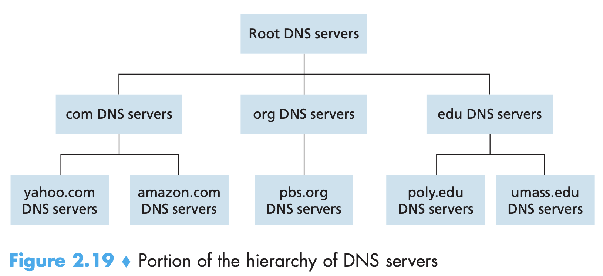

- Internet has 13 **root DNS servers**. Each of them is a network of DNS servers, for **security** and **reliability** purposes - 247 in total.
- **TLD (Top Level Domain) servers** are responsible for domains such as .*com, .org, .fr*
- Every organization with publicly accessible hosts (such as Web servers and mail servers) on the Internet must provide publicly accessible DNS records that map the names of those hosts to IP addresses. An organization’s **authoritative DNS server** houses these DNS records. Orgs can maintain their own server or use a service provider.

- **Local DNS server** does not belong to the hierarchy but is important. Each ISP has a local DNS server. When a host connects to an ISP, the ISP provides the host with the IP addresses of one or more of its local DNS servers (typically through **DHCP - Dynamic Host Configuration Protocol**).
- When a host makes a DNS query, the query is sent to the local DNS server, which acts a proxy, forwarding the query into the DNS server hierarchy. Local DNS server is typically “close” to the host. Local DNS first queries root, then TLD, then authoritative and *then* return s IP address to the host that actually asked for it. Ex., 8 messages in total, can be reduced by **DNS caching**
- TLD server unlike this example does not directly know all the authoritative servers. It may know of an **intermediate DNS server**, which then knows the authoritative one.
- The query from the requesting host to the local DNS server is **recursive** (host asked DNS to provide mapping on its behalf), and the remaining queries are **iterative** (each reply was sent to local DNS itself). Recursive queries travel *all the way to the authoritative server and then all the way back.* (The arrows in the figure would be 1(local)→2(root)→3(TLD)→4(authDNS)→5(TLD)→6(root)→7(local)→8(querying host)

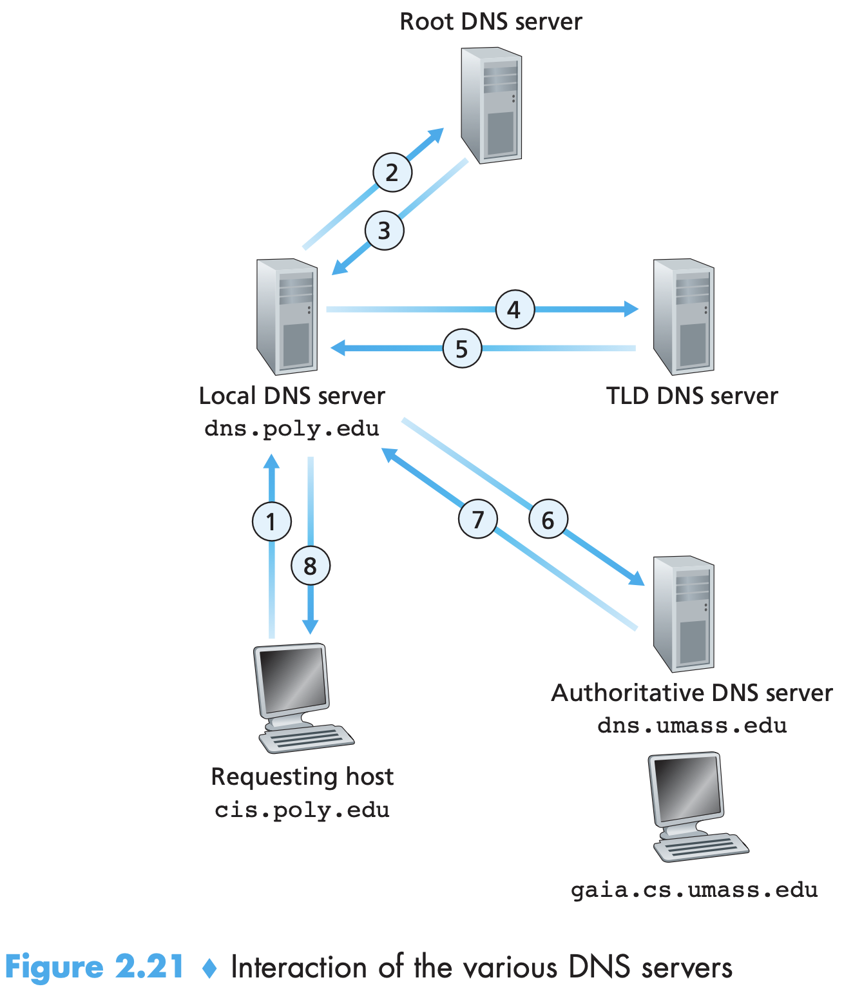

## Chapter 3: Transport Layer

### **Transport Layer (brief):**

- **TCP (Transmission Control Protocol):** Transport protocol with segmentation, connection oriented service, guaranteed delivery, **flow control** (sender/receiver speed matching), **congestion control** (throttle source transmission rate when network is congested)
- **UDP (User Datagram Protocol):** Another transport protocol which is connectionless. Provides none of the above functionality
- Transport layer protocols can offer services along four dimensions: reliable data transfer (deliver data correctly and completely), throughput (guaranteed available throughput at a specified rate), timing, and security.
- TCP is a connection oriented service. Client and server exchange transport layer control information before appl level messages begin to flow. This is called a *handshake* and it alerts the client and server. A **TCP connection** is established after a handshake which must be torn down later. TCP is a also a reliable data transfer service.
- TCP/UDP do not provide timing and throughput guarantees! It is just that current applications have been designed cleverly. Internet can just provide satisfactory service in this regard is all. Internet telephony sometimes prefer UDP because TCP has congestion control but they need a minimal rate. But they also have TCP backup.
- **secure sockets layer (SSL)** is an *enhancement* of TCP, with encryption. TCP and UDP have no encryption by default.

### Transport Layer

- Implemented in software as part of host’s OS.
- Provides e2e communication directly between applications running on different hosts. Provides **logical communication,** meaning that from application’s perspective it’s like the end systems are directly connected. When in reality they may be far apart. Appl. layer uses logical comm provided by transport layer to send messages without worrying about the physical underlying infrastructure.
- Extends network layer’s delivery service from servicing between two end systems to servicing between applications running on the end systems. Ann and Bill sibling letter analogy with post office and distribution at ends. TL functions only on end systems, routers in between do not even see TL segments and they have no effect.
- TL moves messages from process to network edge, no call on how they move in network core. TL guarantees for delay and bandwidth need NL guarantees, whereas TL guarantees for reliable data transfer and confidentiality don’t need NL guarantees.
- Two fundamental problems in networking: 1. how to reliably send data over a medium that may lose/corrupt it 2. how to control transmission rate to avoid/recover from congestion
- TL → logical comm b/w processes, NL → logical comm b/w hosts
- IP is a **best-effort delivery** and **unreliable** service. No guarantee on orderly delivery and integrity of data. Extending host-to-host delivery to process-to-process delivery is called **transport-layer multiplexing** (basically adding the functionality of taking data from multiple sources in appl layer and encapsulating them into a single segment) ****and **demultiplexing** (Delivering received segments at the receiver side to the correct app layer processes) - (Needed for all computer networks, not just internet). UDP just adds process-to-process data delivery and error/integrity checking on top. Nothing else. Hence **unreliable**. TCP also adds **reliable data transfer and congestion control.**
- Appl layer and TL communicate through a **socket**  (door analogy). Thus for routing, each socket connection to an AL process has a unique identifier (**source port number field**). This and the **destination port number field** are added to the segment in TL. Port numbers ranging from 0 to 1023 are called well-known port numbers and are restricted (HTTP 80, FTP 21). Delivering the data in a transport-layer segment to the correct socket is called **demultiplexing**. The job of gathering data chunks at the source host from different sockets, encapsulating each data chunk with header information (that will later be used in demultiplexing) to create segments, and passing the segments to the network layer is called **multiplexing.**
- Typically, the client side of the application lets the transport layer automatically (and transparently) assign the port number, whereas the
server side of the application assigns a specific port number.
- UDP multiplexing is straightforward. Segments with different source address but *same destination host and port number* will be guided to the same UDP socket. UDP socket is uniquely identified by (IP address, port number). Whereas for TCP it is (source IP, source PN, dest IP, dest PN).
- TCP server appl has a welcoming socket on port 12000. When a client creates a socket and sends a connection establishment request, the server checks for the process waiting to accept connections on port 12000 and creates a new socket for communication on its end. If a host is running a web server like Apache server on port 80, all segments including connection establishing ones will have port number 80. Today’s high-performing Web servers often use only one process, and create a new **thread** (new lightweight subprocess) with a new connection socket for each new client connection. Same TCP connection and hence same server socket is used when client and server use **persistent HTTP**. If not, new TCP connection and hence new socket has to be created and closed for every request/response (**non-persistent** HTTP).

### UDP

- Basically does multi/DM and some light error checking on top of IP. Adds port numbers and two other small fields before passing the segment to network layer. There is **no handshake** between sending and receiving TL entities - **connectionless.** DNS uses UDP. If it doesn’t receive a reply (possibly because the underlying network lost the query or the reply), either it tries sending the query to another name server, or it informs the invoking application that it can’t get a reply.
- Some applications may prefer UDP because:
1. *Finer application-level control over what data is sent, and when:* TCP congestion control can throttle senders and it will keep resending packets until it gets a receipt. If you have a min. sending rate, can tolerate some data loss, and do not want overly delayed segment transmissions, you can use UDP and implement any additional functionality that is needed as part of your *application.* For example, reliable data transfer is possible if you build it *into your application,* but it takes a lot of effort.
**2. *No connection establishment:* No wasted time if you don’t care (like DNS). HTTP needs TCP as reliability is critical for web pages with text. TCP connection-establishment delay in HTTP is an important contributor to the delays associated with downloading Web documents
3. *No connection state:* State information is needed for reliable data transfer and congestion control. If you don’t care about these, your server can use UDP and serve many more active clients than over TCP. **Note: connection state** includes: receive and send buffers, congestion-control parameters, and sequence and acknowledgment number parameters.
4. *Small packet header overhead.* TCP segment has 20 bytes of header overhead in every segment, whereas UDP has only 8 bytes of overhead.
- UDP is used for routing table updates (RIP) which happens every five minutes. It is used for carrying network management data (SMNP) as network management applications must often run when the network is in a stressed state. DNS uses UDP. Internet phone and video conferencing react very poorly to TCP’s congestion control.
- No congestion control in UDP can lead to high loss rates and also reduce TCP transmission rates. UDP traffic is blocked by some orgs.
- UDP header has 4 fields of 2 bytes (16bits) each: source port, dest port, length and checksum. Checksum is 1s complement of the sum of all 16-bit words in the appl data (message) part of the segment. At the receiver, all 4 words are added and then added to checksum and we expect 16 1s. From **end-end principle** (which states that since certain functionality (error detection, in this case) must be implemented on an end-end basis: functions placed at the lower levels may be redundant or of little value when compared to the cost of providing them at the higher level.), if we want error detection at the highest level, UDP must provide error detection at the transport layer. This is because neither link-by-link reliability (one of the links may have a link layer protocol without error checking) nor in-memory error detection (bit error introduced when a segment is stored in router’s memory) is guaranteed. Some UDP implementations discard the damaged segment, some pass it with a warning. UDP only does error detection, not recovery.
- The fundamental notion behind the end-to-end principle is that for two [processes](https://en.wikipedia.org/wiki/Process_(computing)) communicating with each other via some communication means, the [*reliability*](https://en.wikipedia.org/wiki/Reliability_(computer_networking)) obtained from that means cannot be expected to be perfectly aligned with the reliability requirements of the processes. Intermediary nodes, such as [gateways](https://en.wikipedia.org/wiki/Gateway_(telecommunications)) and [routers](https://en.wikipedia.org/wiki/Router_(computing)), that exist to establish the network, may implement these to improve efficiency but cannot guarantee end-to-end correctness.

### Reliable data transfer

- Important also at link layer and application layer. TCP uses many of these principles. Top of the fundamentally imp problems in networks.
- With a reliable channel, no transferred data bits are corrupted (flipped from 0 to 1, or vice versa) or lost, and all are delivered in the order in which they were sent.
- Layer below the **reliable data transfer protocol** may be unreliable! (Link layer, physical layer, IP layer even)
- **bidirectional data transfer == full duplex data transfer**
- In an FSM representation, an “event” can result from a procedure call to a method from its upper/lower layer. Initial states are represented by dotted lines. No events/actions are denoted by $\Lambda$
- Reliable data transfer protocols based on **positive/negative acknowledgements (ACK/NAK** replies) ****are called **ARQ** (**Automatic Repeat reQuest) protocols**. 3 capabilities: *error detection, receiver feedback* and  *retransmission* are needed for ARQs.
- **stop-and-wait** protocols are those which need ACK/NAK from receiver before they can accept further data from upper layer.
- Receiver can send **duplicate ACKs** (ie., another ACK for a previously received packet) instead of a NAK. Because packet sequence numbers alternate between 0 and 1, protocol rdt3.0 is sometimes known as the **alternating-bit protocol**.

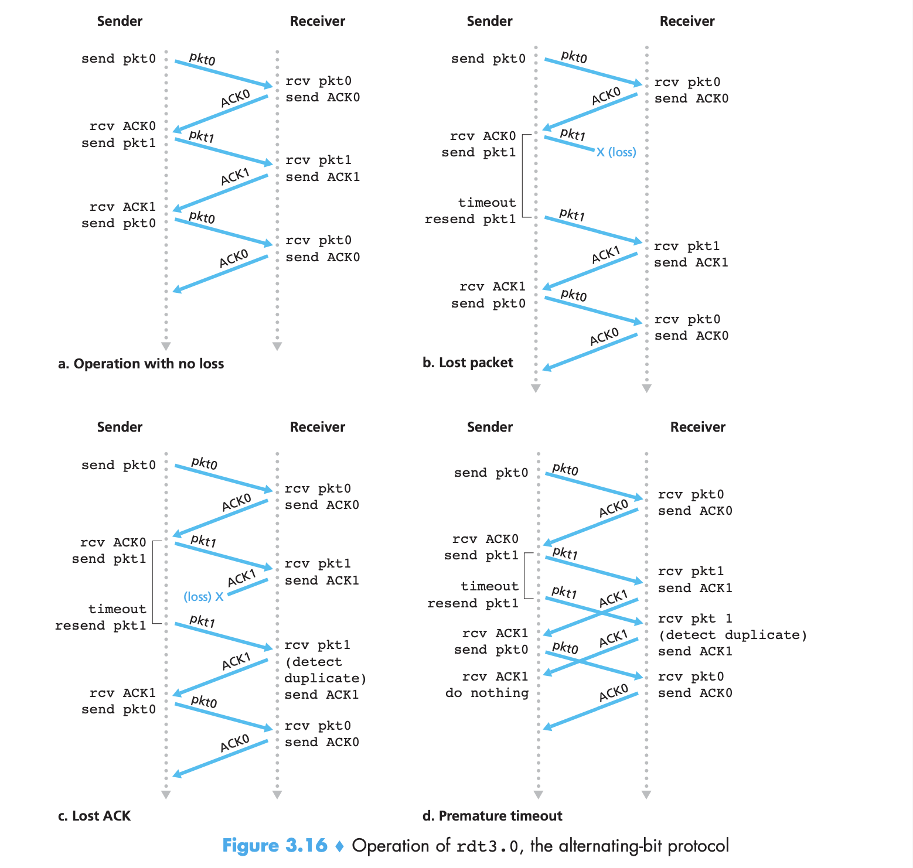

- Packet loss can be due to the packet or the receiver’s ACK of that packet being lost or overly delayed. The sender needs to wait atleast for a full RTT (including buffer and receiver processing time) before it decides to retransmit a packet. Retransmission introduces the possibility of **duplicate data packets** in the channel.
- However, stop and wait protocol has a very bad **utilisation**, the fraction of time for which sender was actually transmitting = (transmission rate(L/R))/(RTT + trans. rate). (RTT is time from last bit of packet sending to the time ACK is received) Thus, sender has to send a series of packets without waiting for ACKS, called **pipelining**. For pipelining, range of sequence numbers at source and receiver must increase, sender and receiver sides of the protocols may have to buffer more than one packet (transmitted but not ACK ones). Two approaches toward pipelined error recovery: **Go-Back-N** and **selective repeat**.
- In **Go-Back-N**: sender can have a maximum of N un ACK packets in the pipeline. *base* is seq num of oldest un ACK packet and *nextseqnum* is the smallest unused seq number. [nextseqnum, base+N-1] are packets that can be sent immediately upon arrival! N is window size and GBN is a **sliding window protocol**. Instead of having unlimited N, putting a cap helps us in **flow control**. TCP has a 32-bit sequence number field, where TCP sequence numbers count bytes in the byte stream rather than packets. The below are called xtended FSMs because extra variables and operations on them have been added.

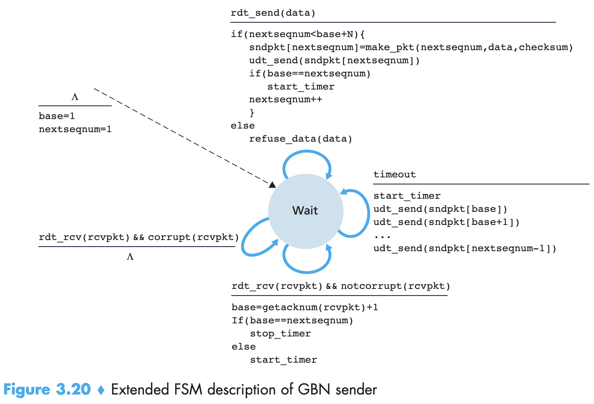

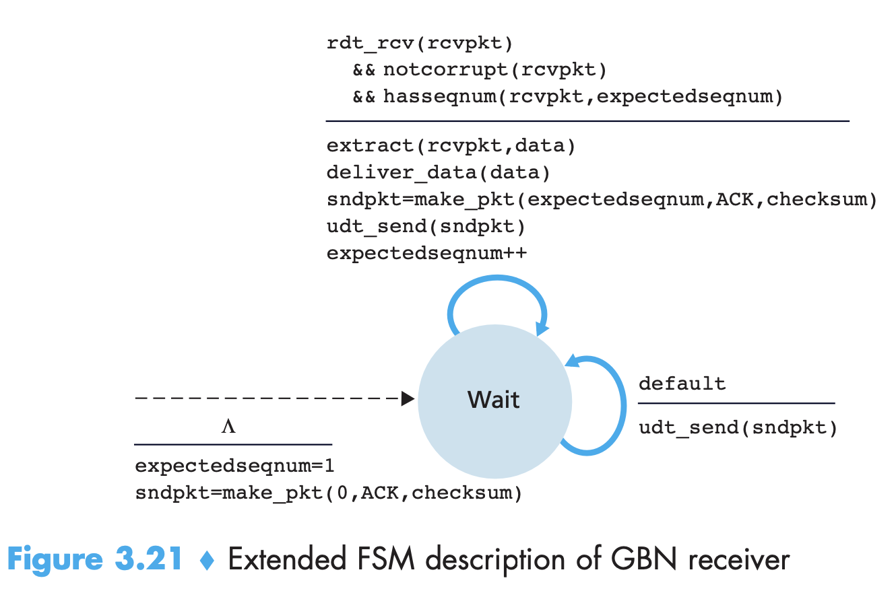

- An ACK for a packet with number n is a **cumulative ACK** for all packets ≤ n. If a timeout occurs, the sender resends all packets that have been previously sent but are still not ACK. Figure uses single timer, which can be thought of as a timer for the oldest transmitted but not yet ACK packet. If an ACK is received but there are still additional transmitted but not yet ACK packets, the timer is restarted. If not un ACK, stopped.
- If packet n+1 arrives before n and n is lost, receiver need not buffer it because n+1 will be retransmitted by the sender anyway.
- GBN protocol incorporates the use of sequence numbers, cumulative acknowledgments, checksums, and a timeout/retransmit operation.

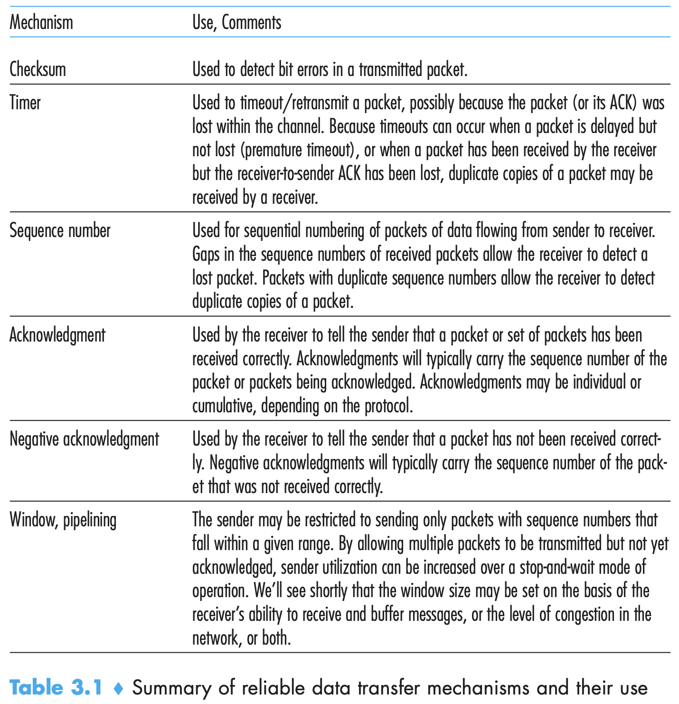

- **Selective Repeat (SR)** protocols avoid unnecessary retransmissions by having the sender retransmit only those packets that it suspects were received in error (that is, were lost or corrupted) at the receiver ⇒ it receives an ACK for each packet it transmitted. Out-of-order packets are buffered until any missing packet is received. **Note** that the sender and receiver sliding windows move forward when the ACK/packet is received for the *base* packet number of the window. The receiver reacknowledges (rather than ignores) already received packets with certain sequence numbers below the current window base. The sender and receiver will not always have an identical view of what has been received correctly and what has not.
- Lack of synchronisation between sender and receiver can actually lead to issues. Due to unforseen cases, the sender might retransmit a packet or send a new one. If the sequence numbers are same, the receiver cannot tell the difference between a retransmission and a new packet! The window size must be ≤ **half** the size of the sequence number space for SR protocols.

- **Packet reordering:** The assumption that packets *cannot be reordered* **fails** when the channel between sender and receiver is a **network**. The channel can be thought of as essentially buffering packets and spontaneously emitting these packets at *any* point in the future. One manifestation of packet reordering is that old copies of a packet with a sequence or acknowledgment number of *x* can appear, even though neither the sender’s nor the receiver’s window contains *x*. Because **sequence numbers may be reused,** some care must be taken to guard against such duplicate packets. The approach taken in practice is to ensure that a sequence number is not reused until the sender is “sure” that any previously sent packets with sequence number *x* are no longer in the network. This is done by *assuming that a packet cannot “live” in the network for longer than some fixed maximum amount of time.* A maximum packet lifetime of approximately three minutes is assumed in the TCP extensions. There exist methods for using sequence numbers such that reordering problems can be completely avoided.

### TCP

- TCP runs only on end systems. Intermediate network elements do not contain a TCP connection state.
- As part of TCP handshake (which is why TCP is called connection oriented), TCP segments are shared and TCP state variables are initialised.
- TCP connection is a **full duplex service** (data can flow back and forth simultaneously) and is **point-to-point** (i.e, between a single sender and receiver). One host to multiple receivers is not possible with TCP.
- TCP handshake is three way, first two do not contain any application layer data as payload. The third one may.
- After data comes from appl layer through the socket, TCP puts it into a **send buffer**. A similar **receive buffer** exists on the receiver’s end.
- Maximum amount of data that can placed in a segment is limited by **maximum segment size (MSS)** which is set after determining the length of the largest link-layer frame (**maximum transmission unit (MTU)**). MSS is the maximum amount of application-layer data in the segment, not the maximum size of the TCP segment including headers.
- TCP sequence numbers are over the stream of transmitted bytes and not over the series of transmitted segments. The acknowledgment number that Host A puts in its segment is the sequence number of the next byte Host A is expecting from Host B. Because TCP only acknowledges bytes up to the first missing byte in the stream, TCP is said to provide cumulative acknowledgments.
- The acknowledgment for client-to-server data is carried in a segment carrying server-to-client data; this acknowledgment is said to be **piggybacked** on the server-to-client data segment.
- Timeout in timeout/retransmit mechanism to recover lost segments must be larger than RTT. How big is RTT? **SampleRTT,** the amount of time between sending a segment to IP and receiving ACK is not estimated for all segments but only for one segment every RTT. TCP never computes a SampleRTT for a segment that has been retransmitted; it only measures SampleRTT for segments that have been transmitted once. EstimatedRTT is then given by **exponential weighted moving average (EWMA):**

$$
EstimatedRTT = (1 – \alpha) • EstimatedRTT + \alpha• SampleRTT, \alpha=0.125
$$

- TCP response is the same for ACK lost, delayed, corrupted - retransmission, as it cannot tell the difference. TCP sender also uses **pipelining**.

$$
DevRTT = (1 – \beta) • DevRTT + \beta•|SampleRTT – EstimatedRTT|, \beta=0.25\\ TimeoutInterval = EstimatedRTT + 4 • DevRTT

$$

- **Timeout Interval** is initially 1 second. It is doubled if a timeout occurs and computed again when next segment is ACK and EstimatedRTT updated. Doubling the timeout interval allows for congestion control as sender will not keep bombarding while router buffers are occupied. Timeout is computed using EstimatedRTT again when ACK is received **or** data is received from appl. layer.
- IP has no guarantee on datagram delivery, in-order delivery and integrity of data. It is best-effort. TCP has to make up for it.
- Unlike convenient timer per segment, recommended TCP timer management procedures use only a *single* retransmission timer, even if there are multiple transmitted but not yet ACK segments. This is because timers add overhead. Timer is associated with oldest unACK segment. If timer is not already running, TCP starts the timer when segment is sent to IP.
- **Scenarios:** 1. If two segments were sent back to back and timed out. Sender will retransmit the **first** segment and restart timer. If the ACK for second segment arrives before *new timeout* it will not be retransmitted! 2. If ACK for first packet is lost but second is received before *first timeout itself*, **cumulative acknowledgement** ensures that sender knows **both** packets were received. So *no retransmission* for either!

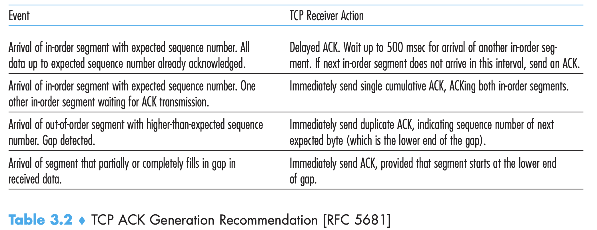

- TCP cannot send negative ACK. So it just sends duplicate ACKs for last in-order byte of data. If sender receives 3 duplicate ACKs for same data, this means the segment following this data has been lost. TCP sender performs a **fast retransmit**, retransmit the segment before its timer runs out.
- TCP sender need only maintain the smallest sequence number of a transmitted but unacknowledged byte (SendBase) and the sequence number of the next byte to be sent (NextSeqNum). So TCP is kind of like GBN. But as seen in error cases above, TCP will not retransmit all segments following a missed segment, it won’t even retransmit the missed segment if cumulative ACK is received. Also, TCP will buffer correctly received but out-of-order segments.
- **ANALYSE after studying**

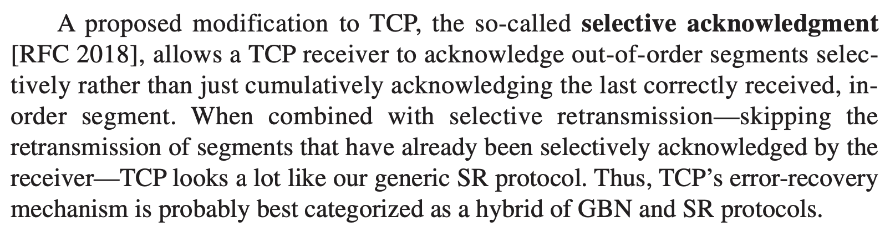

- TCP provides a **flow-control service** to prevent receiver’s buffer from getting overflowed. Data is buffered when it is in sequence and will be there till appl. layer picks it up. Sender maintains a variable called **receive window**. This is equal to the amount of spare room in the buffer **rwnd = RcvBuffer – [LastByteRcvd – LastByteRead]**. Meanwhile Host A makes sure that while sending: **LastByteSent – LastByteAcked ≤ rwnd** (similar inrq. at receiver side). If receiver has nothing to send and its buffer is full and becomes non empty afterwards, sender will never know! Thus sender keeps sending 1 byte segments even when rwnd=0 and keeps receiving ACKs.

**Congestion Control**

- Packet retransmission only treats a symptom of network congestion (the loss of a specific transport-layer segment)
- Costs of congested networks:
    - *Infinite buffer: large queuing delays are experienced as the packet arrival rate nears the link capacity*
    - *Finite buffer with large timeout: the sender must perform retransmissions in order to compensate for dropped (lost) packets due to buffer overflow.*
    - *Finite buffer with premature timeout: unneeded retransmissions by the sender in the face of large delays may cause a router to use its link bandwidth to forward unneeded copies of a packet.*
    - *finite buffer and multihop paths: when a packet is dropped along a path, the transmission capacity that was used at each of the upstream links to forward that packet to the point at which it is dropped ends up having been wasted. Throughput vs offered load inc from zero and then asymptotically decreases to 0.*
- TCP can have **end-to-end** or **network-assisted congestion control** (more recent proposals). In network-assisted, router can provide information directly to sender through a **choke packet** or can mark a congestion bit in the segment, which the receiver will read and inform to the sender. One ex. of network-assisted is **available bit-rate (ABR)** service in **asynchronous transfer mode (ATM)** networks
- In end-to-end, presence of congestion must also be inferred by the network. TCP segment loss (indicated through timeout/duplicate ACKs) is taken as an indication of network congestion and TCP decreases its window size accordingly. A recent proposal uses increasing round-trip delay values as indicators of increased network congestion.
- Sender needs to increase/decrease send rate (**how1?**) based on perceived congestion (**how to perceive?**)? **How to change rate based on congestion?**
- **How1:** Maintain a congestion window as well: **LastByteSent – LastByteAcked ≤ min{cwnd, rwnd}**. Limits the unACK data thereby indirectly controlling senders rate. If no packet/transmission delays, *sender’s send rate is roughly cwnd/RTT bytes/sec.* Adjust cwnd to adjust rate!
- **How to perceive:** Based on packet loss and duplicate ACKs. Use ACKs to increase congestion window size. Slow ACKs ⇒ size increases slowly. Because TCP uses acknowledgments to trigger (or clock) its increase in congestion window size, TCP is said to be **self-clocking**.
- Four ACKs for a segment implies loss of segment following this quadriply ACKed segment. If **segment is lost**, dec rate. If all is good (receiving **new ACKs**): increase rate. Do **bandwidth probing**: keep increasing rate until congestion then back off. **TCP congestion-control algorithm:** 1. slow start (increases size of cwnd more rapidly) 2. congestion avoidance 3. fast recovery
- 

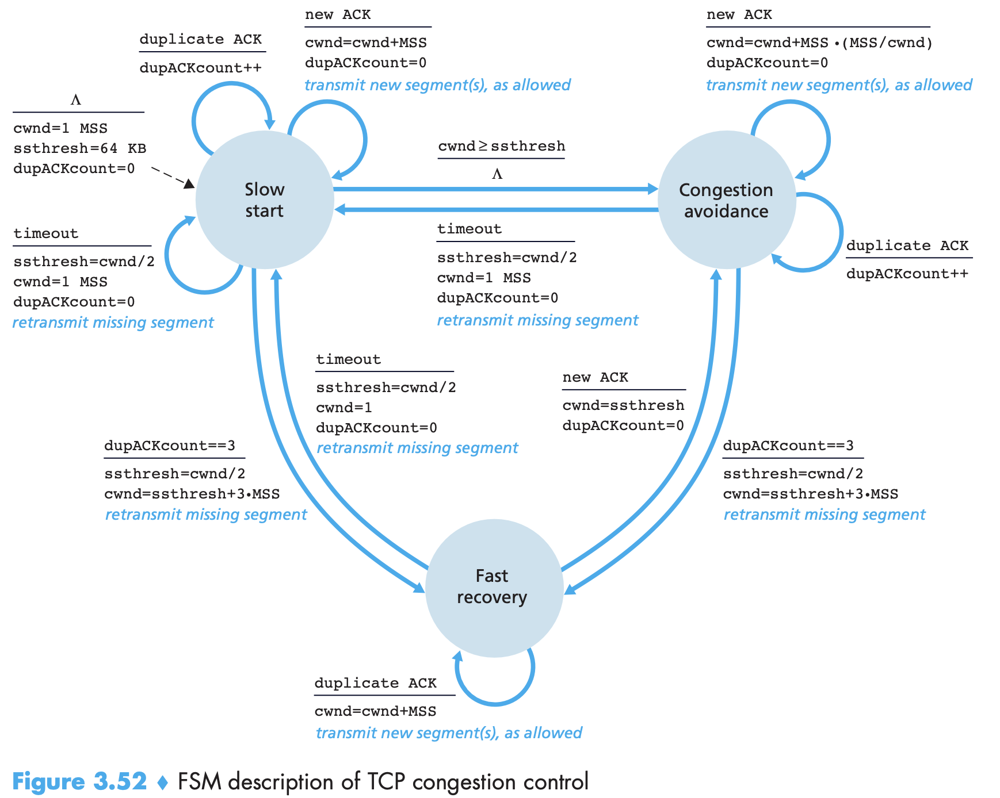

- **Slow start** increases cwnd for *each new ACK* ie., exponential kind of increase. ssthresh is a state variable for slow start threshold. If cwnd ≥ ssthresh it moves to congestion avoidance mode. At timeout ssthresh is set to pre. value of cwnd/2 for safety. If 3 duplicate ACKs, TCP does fast retransmit and moves to fast recovery state.
- In congestion avoidance, increase cwnd more slowly (once **per RTT**). Behaviour at timeout is the same as slow start. But with 3 ACKs the behaviour should be less sever as tranmission is still on.
- To optimise cloud services, **TCP splitting** can reduce response time from 4RTT to RTT (4RTT(fe) + (RTT(be)==RTT) by 1. deploying frontend servers close to users and 2. utilise TCP splitting by breaking the TCP connection at the front-end server. With TCP splitting, the client establishes a TCP connection to the nearby front-end, and the front-end maintains a persistent TCP connection to the data center with a **very large TCP congestion window**
- In fast recovery, the value of cwnd is increased by 1 MSS for every duplicate ACK received for the missing segment that caused TCP to enter the fast-recovery state. Eventually, when an ACK arrives for the missing segment, TCP enters the congestion-avoidance state after deflating cwnd.
- **TCP Tahoe**, unconditionally cut its congestion window to 1 MSS and entered the slow-start phase after either a timeout-indicated or triple-duplicate-ACK-indicated loss event. The newer version of TCP, **TCP Reno**, incorporated fast recovery.
- Fast recovery is just to ensure that there is not too much severity.
- TCP congestion control is often referred to as an **additive-increase, multiplicative-decrease (AIMD)** form of congestion control. **TCP Vegas** detects congestion in the routers between source and destination *before* packet loss occurs (by observing the RTT.), and (2) lowers the rate linearly when this imminent packet loss is detected
- Avg throughput of a connection = 0.75W/RTT, where W is window size when packet loss occurs.

## Chapter 4: Network Layer

- Transport layer’s process to process communication relies on network layer’s host to host communication.
- **Forwarding** involves the transfer of a packet from an incoming link to an outgoing link within a *single* router. **Routing** involves *all* of a network’s routers, whose collective interactions via routing protocols determine the paths that packets take on their trips from source to destination node.
- Network layer also has connection oriented and connectionless services. These differ from transport layer services:     **1.** These are host-host which serve TL whereas those were proc-proc which serve AL.    **2.** NL provides either connectionless (**datagram networks)** or connection oriented (**virtual circuit (VC) networks**), **not both** (mostly).     **3.**  Impl are very different. Connection oriented in TL is implemented at network edge whereas connection service in NL is implemented in routers in network core as well as end systems.
- End system stamps the packet with destination address and pops it into network. Each routers uses the packet’s destination address to forward the packet using a forwarding table that maps destination addresses to output link interfaces. Length of output address in **IP datagram** is **32 bits.** When there are multiple matches, the router uses the **longest prefix matching rule.**
- In a datagram network the forwarding tables are modified by the **routing algorithms**, which typically update a forwarding table every **1-5 minutes** or so. In a VC network, a forwarding table in a router is modified whenever a new connection is set up through the router or whenever an existing
connection through the router is torn down. This could easily happen at a microsecond timescale in a backbone, tier-1 router.
- Because forwarding tables in datagram networks can be modified at any time, series of packets sent from one end system to another may follow different paths through the network and may arrive out of order!

### Routers

- **forwarding function**—the actual transfer of packets from a router’s incoming links to the appropriate outgoing links at that router. Forwarding==switching
- Router has four parts: *input port, output port, switching fabric, routing processor.* First three together implement the forwarding function and are almost always implemented in hardware (needs high speed (nanosec timescale). These forwarding functions are sometimes called the **router forwarding plane.**
- Router - think about roundabout analogy. Where are bottlenecks possible?
- **line card:** a printed circuit board containing one or more input ports, which is connected to the switching fabric
- **Routing processor** executes the routing protocols, maintains routing tables and attached link state information, and computes the forwarding table for the router. It also performs the network management functions. Part of **router control plane** (microsec timescale).

**Input processing**

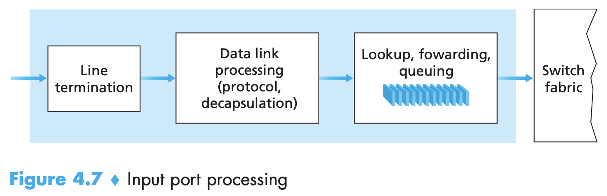

- Line termination: physical layer function of terminating an incoming physical link at a router.
- performs link-layer functions needed to interoperate with the link layer at the other side of the incoming link
- Control packets (eg, packets carrying routing protocol information) are forwarded from an input port to the routing processor.
- Port here (phy. inp and outp interfaces) is different from software ports associated with network appl. and sockets.
- Forwarding table is copied from routing processor to the line card over a separate bus. Shadow copy is maintained.
- packet’s version number, checksum and time-to-live field must be checked and the latter two fields rewritten
- counters used for network management (such as the number of IP datagrams received) must be updated.
- Packets can be queued at input port if switching fabric is currently busy.
- Looking up an IP address and sending packet into switching fabric is a case of “match plus action” abstraction. Also used in link-layer switches - link-layer destination addresses are looked up and several actions may be taken in addition to sending the frame into the switching fabric towards the output port.
- In firewalls—devices that filter out selected incoming packets—an incoming packet whose header matches a given criteria (e.g., a combination of source/destination IP addresses and transport-layer port numbers) may be prevented from being forwarded (action). In a network address translator (NAT), an incoming packet whose transport-layer port number matches a given value will have its port number rewritten before forwarding (action).

**Switching fabric**

- Connects router’s input ports to output ports. 3 techniques: switching via *memory, bus* and *an interconnection network*
- **Memory:** Copy packet from input port to processor memory, find output port, copy to output buffer. If the memory bandwidth is such that *B* packets per second can be written into, or read from memory, then the overall forwarding throughput (the total rate at which packets are transferred from input ports to output ports) must be less than *B*/2.
- Two packets cannot be forwarded at the same time, even if they have different destination ports, since only one memory read/write over the shared system bus can be done at a time.
- Many modern routers switch via memory, but lookup of the destination address and the storing of the packet into the appropriate memory location are performed by processing on the input line cards
- **Switching via bus:** No intervention by routing proc. Input port prepends a switch internal label (packet header). All output ports receive the packet but only matching port keeps the packet. Only one packet at a time can travel. In small LAN and enterprise networks.
- **Switching via interconnection network:** Use crossbar which closes the crosspoint at the intersection of horizontal and vertical bus. Crossbar networks are capable of forwarding multiple packets in parallel, but only when they’re not going to the same output port.

**Output processing**

- **Stores** packets received from switching fabric, (selects and dequeues them, *and then*) transmits them after link layer and phy layer functions. It will be paired with the input port for a link on the same link card if the link is bidirectional.
- **Queuing** can occur at both input and output ports. Assume a transmission rate for N input and output ports and one for switch and work with it. Buffer size can be RTT*C(link capacity), and B = RTT*C/sqrt(N) for large number of TCP flows N.
- **drop-tail** policy is dropping arriving packets when buffer is full. Sometimes a packet is marked (on header) or dropped *before* buffer is full to indicate congestion.
- **Packet scheduler** chooses among queued packets for transmission.  Packet marking and dropping policies are **active queue management** (**AQM**) algorithms one of which is **Random Early Detection** (**RED**) algo. Weighted avg is maintained for length of output queue, with queuing if ≤ min thresh, marking/dropping if ≥ max thresh and with a prob. if in between. **Head of the line (HOL) blocking** is a fancy name for packet in queue having to wait even though its output port is free, just because there is another packet ahead of it that is waiting.

- **Internet Control Message Protocol (ICMP)** is often considered part of but architecturally lies just above IP. ICMP messages are carried inside IP datagrams as payload. It is used by hosts and routers to communicate network-layer information to each other, typically but not just for error reporting.
- ICMP messages have a type and a code field, and contain the header and the first 8 bytes of the IP datagram that caused the ICMP message to be generated in the first place (so that the sender can determine the datagram that caused the error).
- Ping program send type 8 code 0 messages (echo request). Another example is source quench message which is sent to a host to force it to reduce transmission rate. TCP congestion control does not use network layer feedback such as source quench messages. Traceroute uses ICMP messages. Traceroute in the source sends a series of ordinary IP datagrams to the destination. Each of these datagrams carries a UDP segment
with an **unlikely UDP port number**. The first of these datagrams has a TTL of 1,…n. nth router sees TTL of nth datagram expired, discards the datagram and sends an ICMP warning message to the source. This warning message includes the name of the router and its IP address. Finally, it knows it needs to stop when destination host sends a port unreachable ICMP message (because bold), meaning it has reached the host.

### **Routing Algorithms**

- Router attached directly to host: **source router/first-hop router.** Similarly **destination router**
- **global routing algorithm** computes the least-cost path between a source and destination using complete, global knowledge about the network. Such algorithms with global state information are often referred to as **link-state** (**LS**) **algorithms**, since the algorithm must be aware of the cost of each link in the network.
- In a **decentralized routing algorithm**, the calculation of the least-cost path is carried out in an iterative, distributed manner. No node has complete information about the costs of all network links. One such algorithm is **distance-vector (DV) algorithm**, so called because each node maintains a vector of estimates of the costs (distances) to all other nodes in the network.
- In **static routing algorithms**, routes change very slowly over time, often as a result of human intervention. **Dynamic routing algorithms** change the routing paths as the network traffic loads or topology change. Dynamic are more responsive to network changes but are also more susceptible to routing loops and oscillation in routes. In a **load-sensitive algorithm**, link costs vary dynamically to reflect the current level of congestion in the underlying link. Today’s Internet routing algorithms are **load-insensitive.**

**Link State Routing**

- Each node broadcasts **link-state packets** to all other nodes, with each link-state packet containing the identities and costs of its attached links. There are **link-state broadcast algorithms** for this. Dijkstra’s and Prim’s are some link-state routing algorithms.
- after the *k*th iteration of the algorithm, the least-cost paths are known to *k* destination nodes, and among the least-cost paths to all destination nodes, these *k* paths will have the *k* smallest costs. The number of times the loop is executed is equal to the number of nodes in the network.

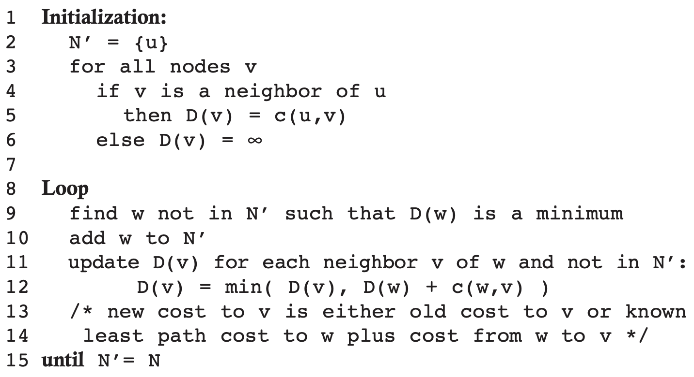

- After the path is reconstructed backwards, the forwarding table stores the next hop from source for each destination.
- Time complexity is O(n^2). Using heap in line 9 to find min can reduce linear to logarithmic time.

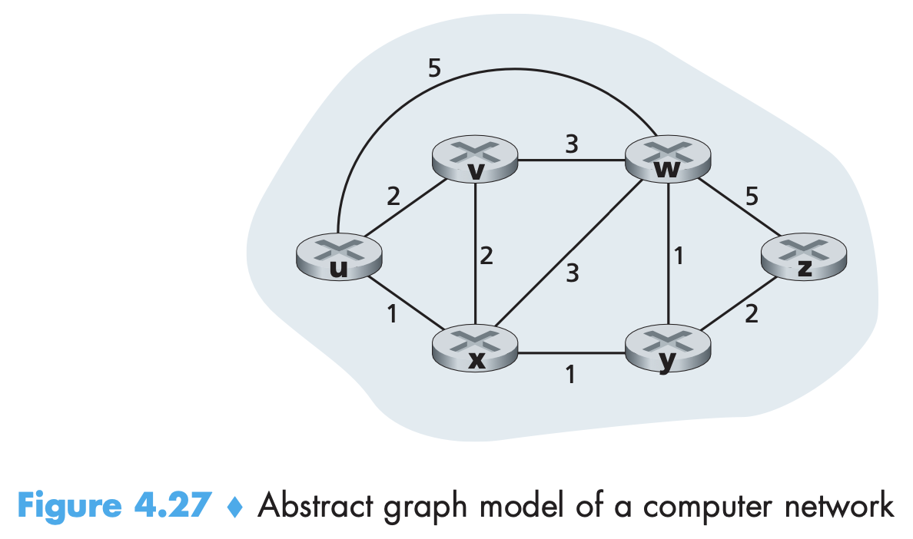

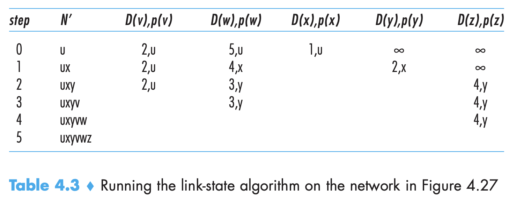

- This and any routing algorithm can face the problem of oscillation when used in edge costs with congestion/delay based metrics, where each time they run LS algo they’ll decide a clockwise/anti direction is best. Either mandate that link costs not depend on the amount of traffic carried or ensure that not all routers run the LS algorithm at the same time. However:
- Researchers have found that routers in the Internet can self-synchronize among themselves. That is, even though they initially execute the algorithm with the same period but at different instants of time, the algorithm execution instance can eventually become, and remain, synchronized at the routers. One way to avoid such self synchronization is for each router to randomize the time it sends out a link advertisement.

**Distance-Vector (DV) Routing Algorithm**

- Iterative (process continues till no more info is exchanged. Then it just stops), async (no need for nodes to operate in lockstep with each other), distributed (each node receives info from neighbours, calculates and distributes results back to them).
- Uses Bellman-Ford equation: $d_{x}(y) = \min_{v}(c(x,v) + d_{v}(y))$

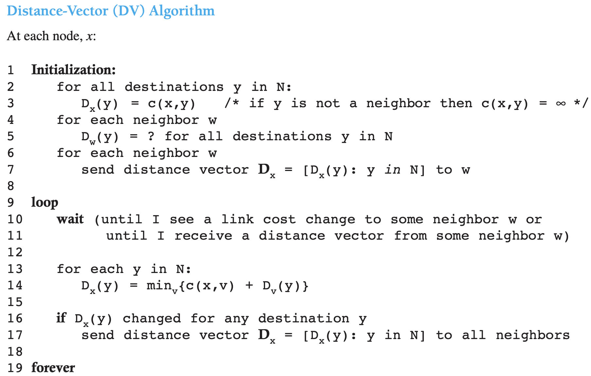

Each node maintains some routing information:

- Cost to each neighbor
- Distance vector: $D_{x} = [D_{x}(y), y \in N]$, estimate of cost to all destinations
- The distance vectors of each of its neighbors
- Uses Bellman Ford to update its DV after receiving neighbor DV

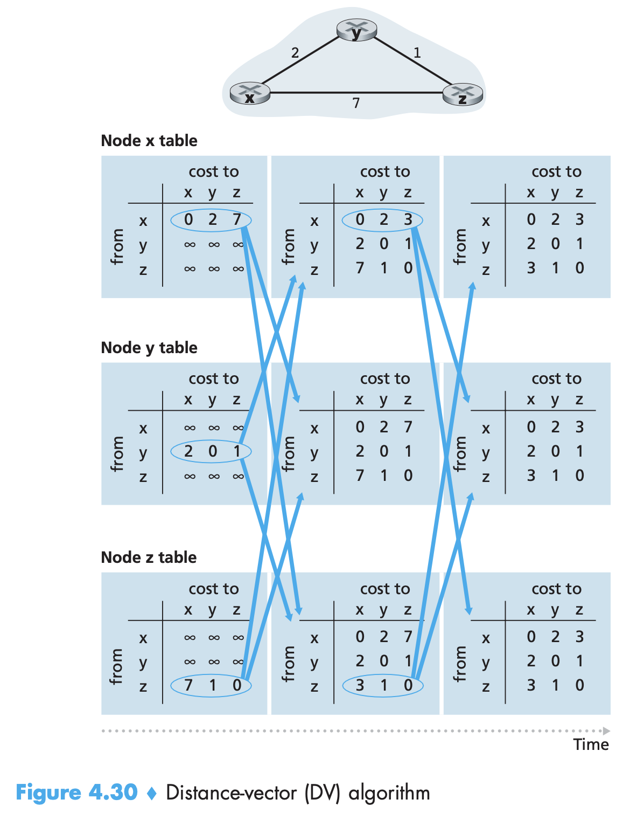

- In some cases when DVs change, recovery can happen quickly but in some cases **routing loops** can occur. Packets will keep bouncing back and forth (take triangle case where distance between two nodes inc significantly.) Lot of iterations can be needed for it to get fixed - (too huge a change, **count-to-infinity problem**). The particular triangle problem on pg. 378 can be solved using a **Poisoned reverse,** if z routes through y to reach x, z will tell y that its distance to x is infinity. Loops involving three or more nodes will not be detected by Poisoned reverse technique, thus it does not solve the count-to-infinity problem in general.
- LS and DV can differ in *message complexity, speed of convergence* and *robustness*. They take complementary approaches to routing. In DV, each node talks to its neighbours and provides estimates of distances to all nodes. In LS, each node talks to everyone but provides costs only of its neighbours.
- **Message complexity:** LS needs O(|N||E|) messages to know cost of each link. Everyone must be updated if a link cost changes. In DV, messages are needed between neighbors and are sent only if new link changes results of least cost paths of nodes attached to that link.
- **speed of convergence:** LS converges in O(n^2). DV can converge slowly and can have routing loops also. It also has count-to-infinity problem.
- **robustness:** Corrupt node in LS can broadcast incorrect cost, but calculation of forwarding table are happening individually ⇒ they are separated. In DV, at each iteration, a node’s calculation in DV is passed on to its neighbor and then indirectly to its neighbor’s neighbor on the next iteration. In this sense, an incorrect node calculation can be diffused through the entire network under DV.
- Routing problems can sometimes be framed as a network flow problem (a constrained optimization problem). Also, **circuit-switched routing algorithms** are of interest to packet-switched data networking in cases where per-link resources (for example, buffers, or a fraction of the link bandwidth) are to be reserved for each connection that is routed over the link.

**Hierarchical routing**

- Routers can’t all be the same and identical. Will lead to problems with **scale** (large overheads in broadcast and memory in maintaining details) and **admin autonomy.** Thus organised into **autonomous systems (AS).** Routing algorithm running within an autonomous system is called an **intra autonomous system routing protocol** (same across AS). **Gateway routers** transfer messages outside of AS.
- An autonomous system (AS) is a collection of routers under the same administrative and technical control, and that all run the same routing protocol among themselves. Each AS, in turn, typically contains multiple subnets.
- **Inter-AS routing protocols** handle 1. obtaining reachability info from neighboring ASes 2. Propagating this info. within AS. Two communicating ASs must run the same inter-AS routing protocol. Whole Internet ASs run BGP4. Forwarding table is set by both inter and intra AS routing algos
- Router puts entry(subnet, router interface that is on least cost path to gateway router to neighbouring AS that can reach x) into fwd. table.
- In **hot-potato routing**, the AS gets rid of the packet as quickly (inexpensively) as possible by having a router send the packet to the gateway router that has the smallest router-to-gateway cost among all gateways with a path to the destination.

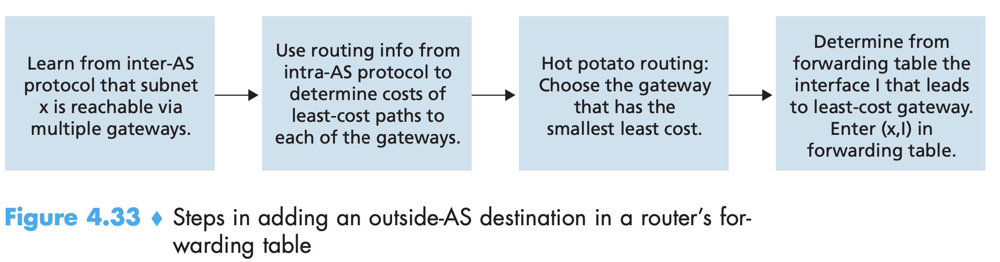

- AS can decide with destinations it wants to advertise to neighbors. All routers in ISP can be in a single AS, or ISPs can partition network into several ASs.

### Routing in the Internet

- **Intra-AS** protocols are also known as **interior gateway protocols.** Two protocols have been used a lot: **Routing Information Protocol (RIP)** and **Open Shortest Path First (OSPF).** A routing protocol closely related to OSPF is the **IS-IS** protocol.
- **RIP** is a DV protocol that is close to the ideal one discussed. RIP uses *hop count* as a cost metric ⇒ each link has a cost of 1. Instead of costs between pairs of routers, they are between source router and a destination subnet. RIP uses the term hop, which is the number of subnets traversed along the shortest path from source router to destination subnet, including the destination subnet.
- Max. cost of a path can be 15, so RIP can be used in ASs that are fewer than 15 hops in diameter.
- In RIP, routing updates are exchanged between neighbors approximately every 30s using a **RIP response message/RIP advertisements**. The response message sent by a router or host contains a list of up to 25 destination subnets within the AS, as well as the sender’s distance to each.
- Each router maintains an RIP table called **routing table** (includes router’s DV and forwarding table). 3 columns: dest. subnet, next router to dest. along shortest path, distance to subnet along this path. In principle, one row for each table but subnets can be aggregated using route aggregation techniques.
- Routing table can be modified if needed upon receiving advertisements. Adverts are exchanged every 30s. If advert not received for 180s from a router, it is considered dead. Routing table is modified accordingly and advertised.

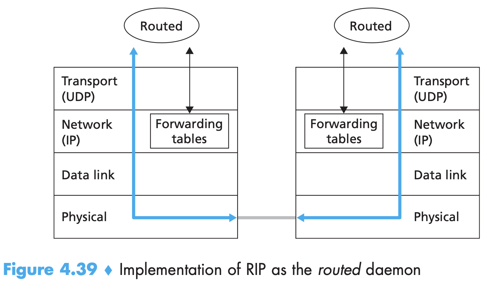

- A router can also request information about its neighbor’s cost to a given destination using RIP’s request message.
- Routers send RIP request and response messages to each other over UDP using port number 520. RIP is implemented as an appl layer protocol over UDP. The UDP segment is carried between routers in a standard IP datagram.
- A process called *routed* (pronounced “route dee”) executes RIP, that is, maintains routing information and exchanges messages with *routed* processes running in neighboring routers.
- This routed process is special as it can manipulate the routing tables within the UNIX kernel.
- While RIP is deployed in lower-tier ISPs and enterprise networks, **OSPF** and **IS-IS** are typically deployed in upper-tier ISPs.
- **OSPF** is a link-state protocol that uses flooding of link-state information and a Dijkstra least-cost path algorithm. It was conceived as a successor to RIP. OSPF does not mandate a policy for how link weights are set, individual link costs are configured by the network administrator.
- A router broadcasts link-state information whenever there is a change in a link’s state (eg, a change in cost or a change in up/down status and also broadcasts a link’s state periodically (at least once every 30 min) regardless of change.
- OSPF advertisements are contained in OSPF messages that are carried directly by IP ⇒  OSPF protocol must itself implement functionality such as reliable message transfer and link-state broadcast. OSPF checks if links are operational via HELLO messages. OSPF also allows an OSPF
router to obtain a neighboring router’s database of network-wide link state.
- OSPF has also made advancements in *security* (messages between routers can be authenticated) in simple or MD5. In simple, passwords are sent in plaintext and same pswd is configured on each router. MD5 authentication is based on shared secret keys that are configured in all the routers. For each OSPF packet the router computes the MD5 hash of the content of the packet appended with the secret key. Like checksum, the receiving packet will compute MD5 hash of the packet and compare with the hash sent over by the router.
- OSPF also has support for *Multiple same-cost paths, support for unicast and multicast routing* (through MOSPF (M→Multicast)) and *Support for hierarchy within a single routing domain.* An OSPF AS can be configured hierarchically into areas, each area having its own OSPF routing state algo. 1 or more **area border routers** are responsible for routing packets outside the area. Each AS has only 1 OSPF **backbone** area to route traffic between the other areas in the AS. Inter-area traffic goes through area border router to backbone to area border to destination.
- **Inter-AS** routing is accomplished through **Border Gateway Protocol (BGP4).** In BGP, pairs of routers exchange routing information over *semipermanent* TCP connections using port 179. For each such TCP connection, routers at the ends are called **BGP peers**, and the connection itself and all the messages exchanged over it are together called a **BGP session**. → **external BGP** (**eBGP**) **session** b/w ASs and **iBGP** within an AS. Note that BGP session lines in Figure 4.40 do not always correspond to the physical links.
- In BGP, destinations are not hosts but instead are CIDRized **prefixes**, with each prefix representing a subnet or a collection of subnets.
- **CIDR prefix** 138.16.64/24 means that first 24/32 bits in the prefix are fixed and rest and flexible. CIDRs 138.16.64/24, 138.16.65/24,
138.16.66/24, and 138.16.67/24 can be aggregated into 138.16.64/22. If one of them is for a different AS, first one can still do aggregation and the actual AS where it belongs can advertise *longer* prefix, due to routers using **longest-prefix matching!**
- When a gateway router (in any AS) receives eBGP-learned prefixes, the gateway router uses its iBGP sessions to distribute the prefixes to the other routers in the AS. When a router (gateway or not) learns about a new prefix, it creates an entry for the prefix in its forwarding table.
- **AS-PATH:** the ASs through which the advertisement for the prefix has passed. Used to detect and prevent looping advertisements and route selection. **NEXT-HOP:** the router interface that begins the AS-PATH. A router has multiple IP addresses, one for each of its interfaces.
- **route selection:** BGP uses eBGP and iBGP to distribute routes (route= prefix+BGP attributes such as AS-PATH and NEXT-HOP) to all the routers within ASs. To select one of them: 1. by highest *local preference* (set/learnt by a router. decided by network admin) 2. by *shortest AS-PATH* (like DV) 3. *by closest (*least cost) *NEXT-HOP* 4. by BGP identifiers.
- An entry in a router’s forwarding table consists of a prefix (e.g., 138.16.64/22) and a corresponding router output port. To add a prefix, the router uses its intra-AS routing protocol (typically OSPF) to determine the shortest path to the NEXT-HOP route to determine the port number to associate with the prefix by identifying the first link along that shortest path. The forwarding table computed by the routing processor (see Figure 4.6) is then pushed to the router’s input port line cards.
- **Routing policy:** All traffic entering and leaving a **stub network** must be destined for/originated from that network. Stub networks are accomplished by **selective advertising**. Even if a stub network knows a path to another network, it will not advertise it and show only paths that are destined to itself. So the other routers simply won’t know and won’t use it.
- A **multi-homed stub network** is connected to the rest of the network via two different providers (a scenario that is becoming increasingly common in practice). For a provider network, it may not want to bear the load of traffic between two provider networks that wish to communicate.
- There are currently no official standards that govern how backbone ISPs route among themselves. A rule of thumb followed by commercial ISPs is that any traffic flowing across an ISP’s backbone network must have either a source or a destination (or both) in a network that is a customer of that ISP; otherwise the traffic would be getting a free ride on the ISP’s network. Individual peering agreements are typically negotiated between pairs of ISPs and are often confidential.
- **why inter and intra AS routing: 
1.Policy** issues are important among ASs. They might want control over what traffic can go through them. BGP carries path attributes and provides for controlled distribution of routing information so that such policy-based routing decisions can be made. Everything is under same control within AS so policy is not important when selecting route.
**2.Scale :** Routing algos and data structures need to handle large number of networks. Within AS it is not too important. If a single administrative domain becomes too large, it is possible to divide it into two ASs and perform inter-AS routing between the two new ASs. (Recall that OSPF allows such a hierarchy to be built by splitting an AS into areas.)
**3.Performance :** Policy is important in inter AS. The quality (for example, performance) of the routes used is often of secondary concern. (Higher cost policy oriented route may be picked!). Indeed, we saw that among ASs, there is not even the notion of cost (other than AS hop count) associated with routes. Within a single AS, however, such policy concerns are of less importance, allowing routing to focus more on the level of performance realized on a route.

### Broadcast routing

- **Unicast routing** is point to point communication. In **broadcast routing**, the network layer provides a service of delivering a packet sent from a source node to all other nodes in the network; **multicast routing** enables a single source node to send a copy of a packet to a subset of the other network nodes.
- Simple approach of **N-way unicast** approach to broadcasting has several issues. 
1. First is inefficiency compared to an algorithm where a hop can make copies if necessary. 
2. Also, the recipients may not be known to the sender and registration of them with the sender (or the broadcast) can add additional overhead. 
3. LS routing protocols use broadcast to disseminate the link-state information that is used to compute unicast routes. Clearly, in situations where broadcast is used to create and update unicast routes, it would be unwise (at best!) to rely on the unicast routing infrastructure to achieve broadcast. ie., if broadcast is used to update unicast, how can we use unicast routes for broadcast purposes?
- A **flooding** approach where source node sends a copy to its neighbors, and each neighbor creates copies and send to *their* neighbors can lead to issues when it is **uncontrolled**. It will work in connected graphs but if the graph has cycles then copies will be cycling indefinitely. A **broadcast storm** can be created resulting from the endless multiplication of broadcast packets, would eventually result in so many broadcast packets being created that the network would be rendered useless. (ie., each copy will create multiple copies of itself and so on)
- For **controlled flooding,** 
In **sequence number controlled flooding** a source puts a **broadcast sequence number** and its address into a packet and sends to all its neighbors. Each node maintains a list of the source address and sequence number of each broadcast packet it has already
received, duplicated, and forwarded. If new packet is present in this list, dropped. Gnutella protocol in appl. layer (where msg duplication and forwarding happens) uses this to broadcast queries in its overlay network.
In **reverse path forwarding (RPF)/reverse path broadcast (RPB)**, when a router receives a broadcast packet with a given source address, it transmits the packet on all of its outgoing links (except the one on which it was received) only if the packet arrived on the link that is on its own shortest unicast path back to the source. Else dropped. Use example to prove if needed. RPF does not use unicast routing to
*actually deliver* a packet to a destination, nor does it require that a router know the complete shortest path from itself to the source. RPF need only know *the next neighbor on its unicast shortest path to the sender*; it uses this neighbor’s identity only to **determine** whether or not to flood a received broadcast packet.
- **Spanning tree broadcast** is because the above 2 approaches do not completely avoid the transmission of redundant broadcast packets. Thus we want a spanning tree of a graph *G* = (*N,E*) is a graph *G’* = (*N,E’* ) such that *E’* is a subset of *E*, *G’* is connected, *G’* contains no cycles, and *G’* contains all the original nodes in *G. S*panning tree whose cost is the min of all of the graph’s spanning trees is called a **minimum spanning tree**. Any node can use the spanning tree to begin a transmission!

Creation and maintenance of this spanning tree is the main cause for complexity here. In the **center-based approach** to building a spanning tree, a center node (also known as a **rendezvous point** or a **core**) is defined. Nodes then unicast tree-join messages addressed to the center node. A tree-join message is forwarded using **unicast routing** (ie., use shortest route!) toward the center until it **1.** either arrives at a node that already belongs to the spanning tree or **2.** arrives at the center. Use example.

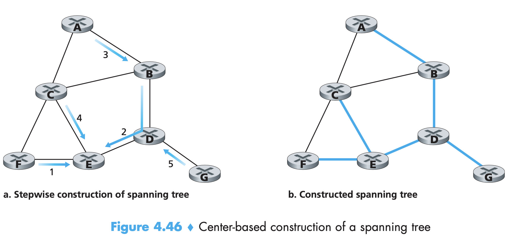

### Multicast routing

- a multicast packet is delivered to only a *subset* of network nodes. Applications in bulk data transfer (for example, the transfer of a software upgrade from the software developer to users needing the upgrade), streaming continuous media (for example, the transfer of the audio, video, and text of a live lecture to a set of distributed lecture participants), shared data applications (for example, a whiteboard or teleconferencing application that is shared among many distributed participants), data feeds (for example, stock quotes)
- **Two** problems—1. how to identify the receivers of a multicast packet and, 2. how to address a packet sent to these receivers
1. Unicast had only one destination, broadcast had **everyone** as destination so no field was needed. Here the subset can be large and sender might not even know everyone. So a multicast packet is addressed using **address indirection.** A single identifier is used for the group of receivers. The single identifier that represents a group of receivers is a class D multicast IP address. The group of receivers associated with a class D address is referred to as a **multicast group**. But each host still has a unique IP address independent of the multicast address of its multicast group. Internet Group Management Protocol answers the group belonging related questions that can arise. (Group address choosing, adding new hosts to group, identity of neighbors etc). A multicast group has an *immediately attached router*
- The goal of multicast routing is to find a tree of links that connects all of the routers that have attached hosts belonging to the multicast group. The tree may contain routers that do not have attached hosts belonging to the multicast group. Even within a group, **not every host needs to be a receiver** for the immediately attached router to be a part of this tree. There are **two** approaches for this tree: use the same tree for all senders or use one tree for each sender.

- *Multicast routing using a group-shared tree:* Similar to spanning tree broadcast. Center node is selected and routers (edge routers with attached hosts) send join messages through unicast routing. Algorithms exist for center selection.
- *Multicast routing using a source-based tree:* an RPF algorithm (with source node *x*) is used (after some tweaking) to construct a multicast forwarding tree for multicast datagrams originating at source *x.* Original RPF needs tweaking because router may forward to another router that has no hosts joined to multicast group! Solution to the problem of receiving unwanted multicast packets under RPF is known as **pruning**. A multicast router that receives multicast packets and has no attached hosts joined to that group will send a prune message to its upstream router. If a router receives prune messages from each of its downstream routers, then it can forward a prune message upstream.
- The first multicast routing protocol used in the Internet was the **Distance-Vector Multicast Routing Protocol (DVMRP).** More widely used is **Protocol-Independent Multicast (PIM) routing protocol**.

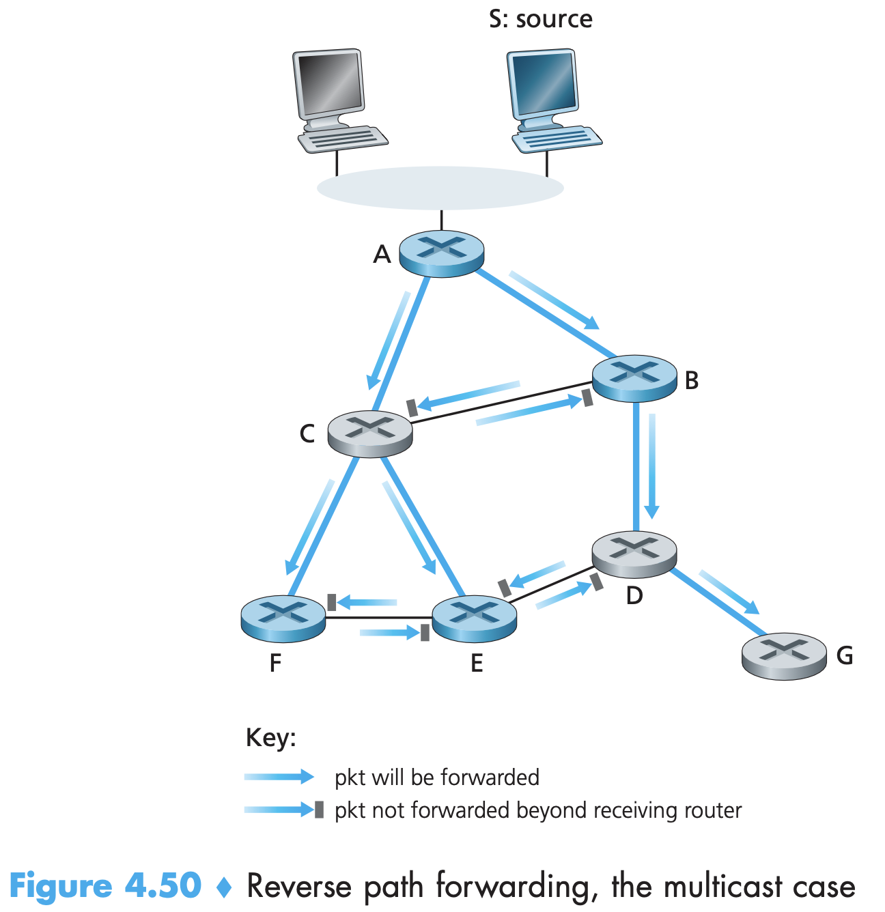

## Chapter 5: Link Layer

- Network layer provides communication b/w any two hosts. Between them, datagrams travel over several packet switches (switches and routers). This layer is about communication over individual links.
- Two types of link layer channels: **broadcast links** and **point-to-point links**. MAC protocol is needed to coordinate frame transmission in broadcast links. In some cases, a central controller may be used to coordinate transmissions; in other cases, the hosts themselves coordinate transmissions.
- Any device that runs a link-layer protocol can be referred to as a **node**. And between two nodes is a **link**. Datagram is encapsulated in a **link-layer frame** and sent over the link. Transportation analogy: each segment can transmit over a different medium but they share responsibility to move to adjacent location.
- **Services provided:**
1. Encapsulation into frames (called **framing**). Frame contains data field with network layer data and several headers.
2. **Link access**: **MAC protocol: Medium Access Control** protocol specifies the rules by which a frame is transmitted onto the link. Simple for point-to-point links, send whenever link is idle. More complicated for broadcast link - called **multiple access problem** when multiple nodes share a single broadcast link. MAC protocol coordinates the frame transmissions of these many nodes.
3. **Reliable delivery:** Achieved by ACKs etc similar to TCP. Adds overhead in low bit error rate mediums such as wired ones, so not used. Wireless links are prone to high error rates so used there to correct error locally instead of forcing e2e transmission by TL or AL protocol.
4. **Error detection and correction:** Unlike checksum, link layer uses more sophisticated methods implemented in hardware for error detection usually caused by signal attenuation and electromagnetic noise. This is done by having the transmitting node include error-detection bits in the frame, and having the receiving node perform an error check. Error detection just detects if error is there, correction finds **where exactly** and corrects it.

- **Link layer implementation:** For routers, it is implemented on its line card. For hosts, it is mostly implemented in a **network adapter**, sometimes aka **network interface card (NIC).**
- At its heart is **controller**, a special chip that implements most LL services (framing, link access, error detection) ⇒ most LL functionality in hardware.
- Most network adapters were physically separate cards till 90s, nowadays LAN-on-motherboard configuration.
- Talk about what happens when a controller is sending and receiving (framing → setting error detection bits → etc.)
- part of the link layer is implemented in software that runs on the host’s CPU. The software components of the link layer implement higher-level link-layer functionality such as assembling link-layer addressing information and activating the controller hardware
- On the receiving side, link-layer software responds to controller interrupts (e.g., due to the receipt of one or more frames), handling error conditions and passing a datagram up to the network layer.

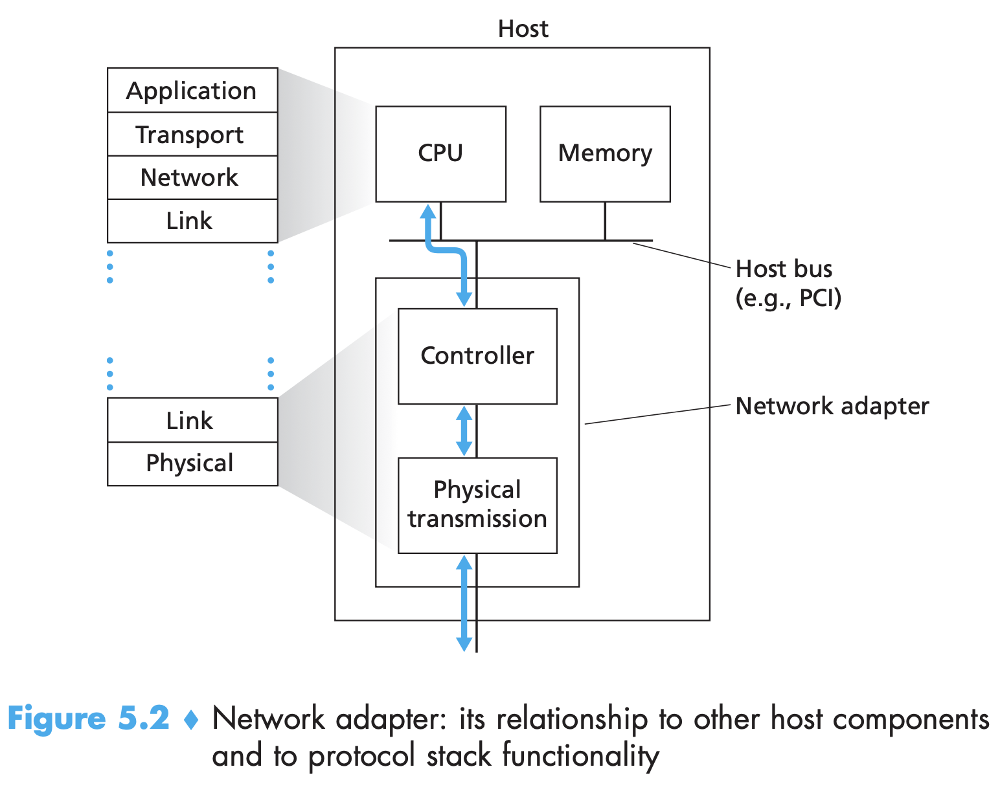

- Link layer is a place where software meets hardware!

### Error detection and correction

- At receiver, we need to able to tell if errors are detected. Error detection and correct bits EDC are sent along with data D. Even with the use of error detection bits there may still be **undetected bit errors**. More sophisticated detection techniques have higher overhead. 3 types: parity, checksum (TL) and cyclic redundancy checks (used in LL in an adapter)

**Parity**

- If you use only one **parity bit** and decide on even parity scheme, the receiver will know an error has occurred if the number of bits in the received *d+1* bits is odd (atleast one bit error has occurred). But even number of bit errors will be left undetected.
- Probability of multiple bit errors in a packet is small if buts are assumed to be independent, but bit errors occur in **bursts**. Under burst error conditions, the probability of undetected errors in a frame protected by single-bit parity can approach 50 percent.
- A **two-dimensional parity scheme** with parity bits for each row and column (along with extra bit at corner) can *detect and correct* single bit errors in both original data and parity bits themselves! It can also detect (but not correct) any combination of two errors in a packet.
- The ability of the receiver to both detect and correct errors is known as **forward error correction (FEC)**. Allows for immediate correction of errors at receiver, helping avoid delay caused by negative ACK and retransmission.

**Checksum**

- **Checksumming** treats d bits of data as k-bit integers, (**Internet checksum** treats as 16-bit). Take 1s complement of the sum of these integers. Receiver takes sum of all integers including checksum and checks if result is all 1s. If not, error. In the TCP and UDP protocols,
the Internet checksum is computed over all fields (header and data fields included). In IP the checksum is computed over the IP header (since the UDP or TCP segment has its own checksum). Other protocols can have multiple checksums computed over header and packets.
- Checksumming is used at TL despite weak protection because software impl needs faster algorithms with less overhead and memory. CRC is implemented in hardware which can handle more complex operations.

**CRC**

- CRC codes are also known as **polynomial codes.** Consider a d-bit data. Sender and receiver agree on r+1 bits called **generator G.** Required that leftmost (most significant) bit of G be 1. Sender chooses r bits such as d+r is divisible by G using modulo-2 arithmetic. If not, error has occurred.
    - **Modulo-2**: No carries or borrows in addn/sub ⇒ both ops are XOR only. No borrow in addn/subn even used in mul/div. Mul by 2^k shifts pattern by k bits to the left. Intl standards are defined for generator G of 8,16,12,32, bits.

$$
D.2^rXOR R = nG \\
D.2^r = nG XOR R \\
R = remainder\frac{D.2^r}{G}
$$

- Each of the CRC standards can detect burst errors of fewer than *r* + 1 bits. This means that all consecutive bit errors of *r* bits or fewer will be detected. Under appropriate assumptions, a burst of length greater than *r* + 1 bits is detected with probability 1 – 0.5^*r*. Also, each of the CRC standards can detect any odd number of bit errors.

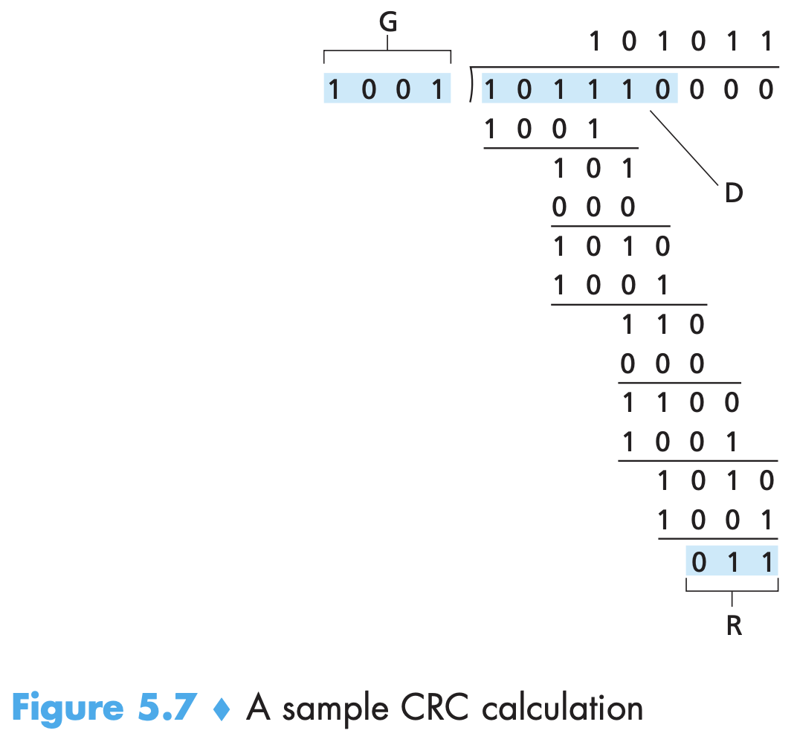

### MAC protocols

- A **broadcast link**, can have multiple sending and receiving nodes all connected to the same, single, shared broadcast channel. The term *broadcast* is used here because when any one node transmits a frame, the channel broadcasts the frame and each of the other nodes receives a copy. Ethernet and wireless LANs are examples of broadcast link-layer technologies.
- How to coordinate the access of multiple sending and receiving nodes to a shared broadcast channel—the **multiple access problem**. Broadcast channels are often used in LANs or networks organised in a single building (corporate or uni networks). Hundreds or even thousands of nodes can directly communicate over a broadcast channel.
- When multiple nodes transmit at the same time, the receiving nodes receive multiple frames at the same time ⇒ the frame **collide.** The signals get mixed up and the broadcast channel is wasted during the collision interval.
- Three types: **channel partitioning protocols**, **random access protocols**, and **taking-turns protocols**.
- Our requirements from a MAC protocol are: 
1. Single node should see throughput of R, 
2. Multiple (M) nodes should see *average* throughput of R/M, 
3. Protocol is decentralised - no master node or single point of failure
4. Protocol is simple hence inexpensive to implement

**Channel Partitioning Protocols**

- TDM and FDM are two techniques that can be used to partition a broadcast channel’s bandwidth among all nodes sharing that channel. Assume R is transmission rate of a link and it has N nodes on it.
- TDM divides time into **time frames** and each frame into N **time slots**, one for each node. Time slot is usually large enough to trasmit a single link-layer frame (referred to as a *packet*). 2 drawbacks:
1. Because each node gets R/N bps even when it is the only one sending, its throughput is limited.
2. Even if a node is the only one transmitting, it has to keep waiting for its turn
- FDM divides R bps channels into into frequencies of bandwidth R/N. Even in FDM a node is limited to a bandwidth of *R*/*N.*
- **code division multiple access (CDMA)** uses codes given to each node. Multiple nodes can transmit simultaneously and receiver correctly receive a sender’s encoded data bits (assuming the receiver knows the sender’s code) in spite of interfering transmissions by other nodes. Used in military for its anti-jamming properties but now widely used in cellular. Use is tightly tied to wireless channels.

**Random Access Protocols**

- Transmitting node always transmits at full rate Rbps. When there is a collision, a node waits for a random delay and then retransmits until frame gets through without collisions. Each node in the collision chooses independent random delays. Types: **ALOHA protocols, carrier sense multiple access (CSMA)** (of which Ethernet is a wide deployment) and much much more.
- **Slotted ALOHA:**
1. There a few assumptions: All frames consist of L bits, time is divided intlo slots of L/R  (each time slot if enough for 1 frame),  nodes start to transmit frames **only** **at the beginning** of slots, The **nodes are synchronized** so that each node knows when the slots begin. All nodes involved in a collision detect it **before** the time slot ends

2. When node has a fresh frame, transmit it at the beginning of the next time slot. If there is no collision, prepare for next tranmission if needed. If collision, retransmit in each subsequent frame with no probability until no collision occurs.

3. Slotted ALOHA allows each node to use full transmission capacity, is highly decentralised as each node detects collisions and independently decides when to retransmit. It is also very simple.

4. Works well with one active node. With multiple active nodes:
i. Slots where collisions happen will be wasted. A slot in which exactly one node transmits is said to be a **successful slot**.
ii. After collision the nodes will wait with probability 1-p which can lead to unused empty slots.
iii. **Efficiency** of a slotted MAC is the long-run fraction of successful slots when there is a large number of nodes with a high number of frames in each. Probability of success of N nodes is $Np(1-p)^{N-1}$, with maximum efficiency at 1/e = **0.37.** Also, 37 percent of the slots go empty and 26 percent of slots have collisions.
- **Pure ALOHA** is unslotted, fully decentralized protocol. It transmits as soon as a frame first arrives, and retransmits with probability p when a collision happens (after fully transmitting the collided frame). To analyse this one focus on a single node. It should transmit and all others should (1. not begin transmission in previous slot, 2. not transmit in the current slot where my node is transmitting) ⇒ prob. of successful transmission = $p(1-p)^{2(N-1)}$. Maximum comes out to be 1/2e, half of slotted ALOHA.

**Carrier Sense Multiple Access**

- In pure and slotted ALOHA, decisions to transmit were made independently by nodes regardless of other nodes’ actions and channel occupancy. Follow two human rules here: **carrier sensing** (listen before speaking/transmitting ⇒ node waits until it detects no transmissions for a short amount of time and then begins) and **collision detection** (If it detects that another node is transmitting an interfering frame, it stops transmitting and waits a random amount of time before repeating the sense-and-transmit-when-idle cycle) → lead to **CSMA** and **CSMA/CD** protocols.
- Collisions can occur despite carrier sensing because of **channel-propagation delays**, ie., how long it takes signal to propagate from one of the nodes to another (for the other to realise transmission is going on). Larger the delay higher the chance of collisions.
- Nodes need to wait a **random time** after collision because fixed time won’t help. Waiting time should be small for small number of colliding nodes and large for large. In **binary exponential backoff algorithm**, when transmitting a frame that saw n collisions, K value is chosen at random from $\{0,1,2,..2^n-1\}$. Thus larger n ⇒ chance of larger K. Set size grows exponentially with n.
- When preparing a new node for transmission these recent collisions are not taken into account ⇒ new frame may just sneak in and successfully transmit!

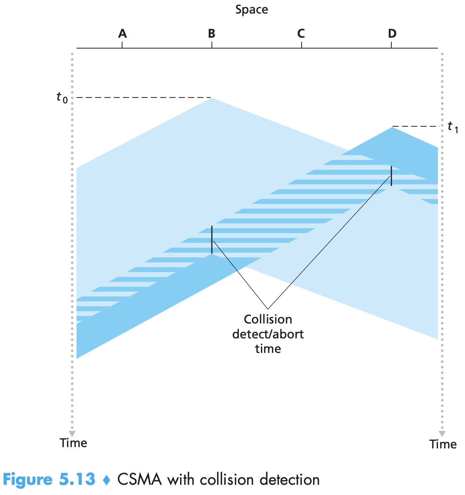

- CSMA/CD **Efficiency** is given by the following, where d-prop and d-trans are max. time for prop between any two adapters and the time to transmit a max sized frame respectively. d-prop is 0 and a large d-trans lead to efficiency 1 (large d-trans ⇒ productive work most of the time)
    
    $$
    \frac{1}{1+5d_{prop}/d_{trans}}
    $$
    

**Taking turns protocols**

- CSMA does not address the throughput requirement of R/M when M nodes are active. **Polling protocols** have a master node that **polls** each of the nodes in a round robin fashion. If a node wants to transmit it has a maximum number of frames it will be allowed to. Master node will know it is done when there is no signal anymore. Thisp protocol introduces a **polling delay**, and if the master node fails the whole channel goes down. 802.15 and Bluetooth are examples.
- In **token-passing** protocol the nodes will hold a token during transmission and pass it on when done/not needed. Here too failure of one node can crash the whole channel. And if a node neglects to release the token a recovery procedure must be performed.

### Switched Local Area Networks

- **“Router with four switches”** - what does this mean?
- Switches operate at the link layer (called **layer-2 switches**) and don’t recognise network layer address ⇒ no BIP/OSPF. They use link-layer addresses to forward link-layer frames through the network of switches.

**Link Layer Addressing: MAC addresses**

- It is not routers and hosts but their adapters that have MAC addresses. Link-layer switches do not have link-layer addresses associated with their interfaces that connect to hosts and routers because the its job is to carry datagrams between hosts and routers; a switch does this job transparently, that is, *without the host or router having to explicitly address the frame* to the intervening switch.
- Link-layer address = **LAN address = MAC address = physical address**
- MAC address is 6 bytes long ⇒ 2^48 combinations. Companies purchase first 24 bits for manufacturing adapters and the last 24 are for them. Specified in hexadecimal notation.
- MAC address has a flat-structure (compared to IPs hierarchical) and does not change no matter where it goes. IP address have a network part and a host part in contrast (**STUDY THIS AND ADD A SECTION**)
- Sending adapter inserts the destination adapter’s MAC address into the frame and then sends the frame into the LAN. A switch occasionally broadcasts an incoming frame onto all of its interfaces. 802.11 also broadcasts frames. Adapter after receiving checks the destination MAC address on the frame to match with its own. If match, extracts the datagram and passes up the protocol stack.
- Sometimes a sending adapter *does* want all the other adapters on the LAN to receive and ***process*** the frame it is about to send. If so, it inserts a special MAC **broadcast address** into the destination address field of the frame. For LANs that use 6-byte addresses (such as Ethernet and 802.11), the broadcast address is a string of 48 consecutive 1s.
- **Why separate LAN address?
1.** LANs are designed for arbitrary network-layer protocols, not just for IP and the Internet. If adapters were assigned IP addresses rather than “neutral” MAC addresses, then adapters would not easily be able to support other network-layer protocols. 
**2.** If adapters were to use network-layer addresses instead of MAC addresses, the network-layer address would have to be stored in the adapter RAM and reconfigured every time the adapter was moved (or powered up). 
**3.** If instead we have no address for adapters, then the host will have to be troubled for every frame sent on the LAN, even when intended for other hosts. 
In summary, in order for the layers to be largely independent building blocks in a network architecture, different layers need to have their own addressing scheme. We have now seen three types of addresses: **host names** for the application layer, **IP addresses** for the network layer, and
**MAC addresses** for the link layer.

**Address Resolution Protocol (ARP)**

- Translates between MAC address and IP address. It is analogous to DNS which translates host names to IP addresses. But DNS resolves hostnames for hosts anywhere in the internet but **ARP resolves IP addresses only for hosts and router interfaces on the same subnet.**
- Source adapter gives destination IP to ARP and it returns MAC address, which the source adds to the constructed LL frame.
- Each router has **ARP table** in memory, with IP address, MAC address and TTL (time-to-live → which indicates when each mapping will be deleted) - typically 20 mins. Table does not necessarily contain an entry for every host and router on the subnet
- If entry for IP is not present in the table, an **ARP packet** is constructed which has fields for IP and MAC address of sender and receiver. ARP query and response packets have the same format. It queries all the other hosts and routers for the MAC address of the IP address being resolved ⇒ It sets destination as MAC broadcast address! → all Fs
- ARP packet is a special kind of packet. It is wrapped in a LL frame before it is sent out. Each adapter passes the ARP packet within the frame up to its ARP module, which checks to see if its IP address matches the destination IP address in the ARP packet. The one with a match sends back to
the querying host a response ARP packet with the desired mapping, using which the sender’s ARP table is updated.
- ARP is plug-and-play; that is, an ARP table gets built automatically—it doesn’t have to be configured by a system administrator. ARP packet is encapsulated within a frame so it is above LL, but it contains LL level MAC addresses so it arguably is a LL protocol. ARP is probably best considered a protocol that straddles the boundary between the link and network layers.
- There is an ARP module **per interface**. A router with 2 interfaces has two IP addresses, two ARP modules, and two adapters, which each adapter having its own MAC address. For sending a datagram across subnets, sending adapter cannot simply use MAC address of ultimate destination, no other router would even let that frame up to its network layer because the LL address does not match. Thus, the adapter creates the frame with the MAC address of the interface of the first hop router which will first receive this frame. This frame travels to the network layer of the router as a datagram, the router finds out destination IP and exit interface from its forwarding table, and *then* the frame is created with the MAC address of the ultimate destination (when one router and two subnets) and passed out of the router.

**Ethernet**

- Ethernet is by far the most prevalent wired LAN technology. It is to local area networking what Internet is to global area networking. It has several reasons for its success compared to other LAN technologies like token ring, FDDI, and ATM which succeeded in capturing the market from ethernet for a while.
- **4** reasons for Ethernet success:

1. Ethernet was the **first** widely deployed high-speed LAN. Because it was deployed early, network administrators became intimately familiar with Ethernet and were reluctant to switch over to other LAN technologies when they came on the scene.

2. Token ring, FDDI, and ATM were more complex and expensive than Ethernet, which further discouraged network administrators from switching over.

3. The most compelling reason to switch to another LAN technology (such as FDDI or ATM) was usually the higher data rate of the new technology. However, Ethernet always fought back, producing versions that operated at equal data rates or higher. Switched Ethernet was also introduced in the early 1990s, which further increased its effective data rates.

4. Finally, because Ethernet has been so popular, Ethernet hardware (in particular, adapters and switches) has become a commodity and is remarkably cheap.
- The original Ethernet LAN used a **coaxial bus** to interconnect the nodes. Ethernet with a **bus topology** is a broadcast LAN—all transmitted frames travel to and are processed by *all* adapters connected to the bus. It uses CSMA/CD protocol  with binary exponential backoff.
- By the late 1990s, most companies and universities had replaced their LANs with Ethernet installations using a **hub-based star topology**. In such an installation the hosts (and routers) are directly connected to a **hub** with twisted-pair copper wire. A **hub** is a **physical-layer device** that acts on individual bits rather than frames. When a bit, representing a zero or a one, arrives from one interface, it simply re-creates the bit, boosts its energy strength, and transmits the bit onto all the other interfaces. Thus, Ethernet with a hub-based star topology is also a broadcast LAN. If a collision occurs, the nodes responsible must retransmit.
- Later, this star topology was maintained but replaced with a **switch**. A switch is not only “collision-less” but is also a bona-fide **store-and-forward packet switch**; but unlike routers, which operate up through layer 3, it **operates only up through layer 2.**

**Link-layer switches**

- Switch receives incoming LL frames and forwards them onto outgoing links. It is **transparent**, meaning the adapter addresses a frame to another host/router without knowing that a switch will receive and forward. Frames are not addressed to the switch. Because rate at which frames arrive at its output interface can be more than link capacity, switch output buffers also have an output buffer like routers.
- **Filtering** is the switch function that determines whether a frame should be forwarded to some interface or should just be dropped. **Forwarding** is the switch function that determines the interfaces to which a frame should be directed, and then actually moves the frame to those interfaces too.
- Switch filtering and forwarding are done with a **switch table,** which contains some but not necessarily all of the hosts and routers on the LAN. A switch table entry has 3 cols: 1. MAC address, 2. Interface leading to that MAC address, 3. Time when the entry was added.
- When a frame arrives from an incoming interface x:
1. If there is no entry for destination MAC address in the switch table, switch broadcasts the frame into all interfaces except x.
2. If MAC address corresponding interface is x itself, no need to forward, so the switch **discards** the frame - **filtering**
3. If there is entry for MAC with interface y≠x, switch does **forwarding** by putting the frame in an output buffer that precedes interface *y*.
In this sense a switch is **smarter** than a hub.
- Switches are **self-learning**. Switch table is built automatically, dynamically, and autonomously without manual intervention or config protocols. 
1. Table is initially empty.
2. If a frame **arrives,** it stores the MAC address stored in the frame’s *source address field,* the interface from which it arrived and time of entry. Thus if every host send a frame, it will get recorded.
3. The switch deletes an address in the table if no frames are received with that address as the source address after some period of time (the **aging time of the switch**). So if a PC is replaced by another PC with a different adapter, MAC address of the first PC will be **purged** from the switch table.
- Switches are **plug-and-play devices** because they require no intervention from a network administrator or user. Just connect the LAN segments to the switch interfaces. Switches are also **full-duplex**, meaning any switch interface can send and receive at the same time.
- Switches have benefits in:
1. Elimination of collisions in LANs built with switches and without hubs. The switches buffer frames and never transmit more than one frame on a segment at any one time. As with a router, the maximum aggregate throughput of a switch is the sum of all the switch interface rates. Thus, switches provide a significant performance improvement over LANs with broadcast links.

2. Heterogenous links: Because a switch isolates one link from another, the different links in the LAN can operate at different speeds and can run over different media. Switches are good for mixing legacy equipment with new equipment.

3. Security: Because a switch does not broadcast like 802.11 LANs or hub–based Ethernet LANs), it is more difficult for an attacker to sniff frames. **Switch poisoning** sends many packets to the switch with bogus MAC addresses to fill the table, so that all future packets within the LAN will be broadcast and can be sniffed. But this attack is rather involved so switches are safer than hubs and wireless LANs.

4. Easing network management: A switch can disconnect adapter sending too many frames due to malfunction. Cable cut disconnects only that host that was using the cut cable to connect to the switch. Switches also gather statistics on bandwidth usage, collision rates, and traffic types, and make this information available to the network manager. This information can be used to debug and correct problems, and to plan how the LAN should evolve in the future.
- **Switches vs routers**

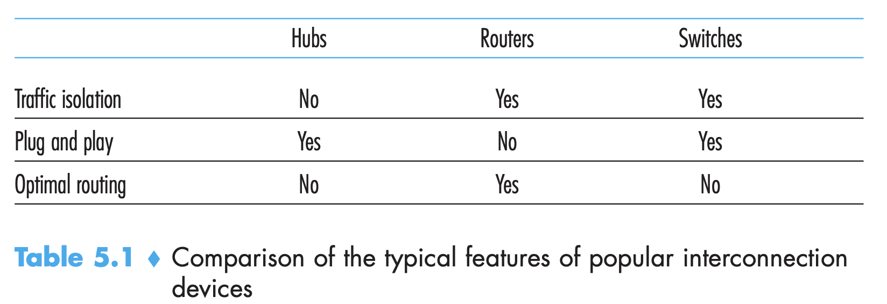

- **Switch pros: 
1.** Switches are plug and play. 
2.They can also have relatively high filtering and forwarding rates as they have to process frames only up through layer 2, whereas routers have to process datagrams up through layer 3.
- **Switch cons:** 
1.To prevent the cycling of broadcast frames, the active topology of a switched network is restricted to a spanning tree. 
2. Switches are susceptible to broadcast storms—if one host goes haywire and transmits an endless stream of Ethernet broadcast frames, the switches will forward all of these frames, causing the entire network to collapse.
3. A large switched network would require large ARP tables in the hosts and routers and would generate substantial ARP traffic and processing.
- **Router pros: - opposite of first two switch cons
1.** Because network addressing is often hierarchical (and not flat, as is MAC addressing), packets do not normally cycle through routers even when the network has redundant paths. Packets **can cycle** when router tables are misconfigured; but IP uses a special datagram header field to limit the cycling. Thus, packets are not restricted to a spanning tree and can use the best path between source and destination. Because routers do not have the spanning tree restriction, they have allowed the Internet to be built with a rich topology that includes, for example, multiple active links between Europe and North America.
2. Routers also provide firewall protection against layer-2 broadcast storms.
- **Router cons: - opposite of switch pros**
1. Not plug and play, they and the hosts that connect to them need their IP addresses to be configured.
2. Routers often have a larger per-packet processing time than switches, because they have to process up through the layer-3 fields.
- **When to use what?** Small networks consisting of a few hundred hosts have a few LAN segments. Switches suffice for these small networks, as they localize traffic and increase aggregate throughput without requiring any configuration of IP addresses. But larger networks consisting of thousands of hosts typically include routers within the network (in addition to switches). The routers provide a more robust isolation of traffic, control broadcast storms, and use more “intelligent” routes among the hosts in the network.

### WiFi: 802.11 Wireless LANs

- Several standards for wireless LANs were developed in the 90s, but 802.11 wireless LAN emerged as the winner. Also called WiFi.
- Several standards (802.11b/a/g) exist with 
1. varying freq range and data rate (differences in **physical layer** among three standards. 
2. They use same medium access protocol, 
3. Same LL frame structure and 
4. All can reduce their transmission rate in order to reach out over greater distances.
5. All three standards allow for both “infrastructure mode” and “ad hoc mode,” Several dual- and tri-mode devices available.

*Details of standards:*

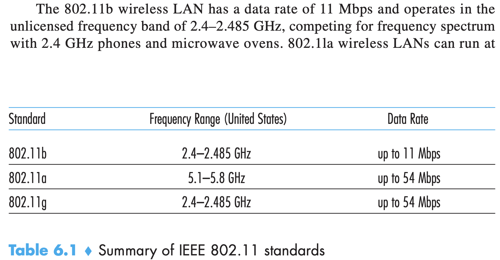

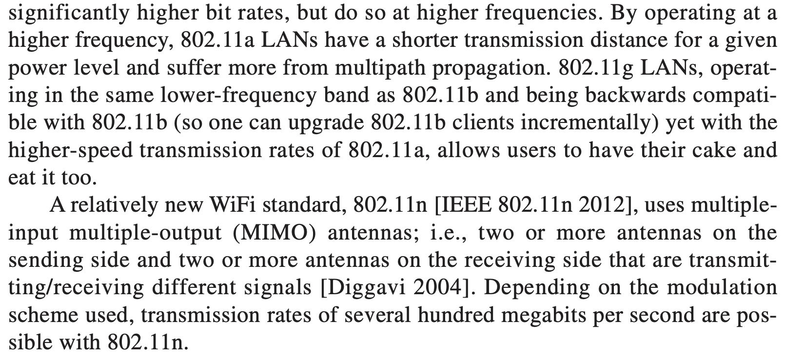

**802.11 architecture**

- The fundamental building block of the 802.11 architecture is the **basic service set (BSS)**. A BSS contains one or more wireless stations and a central **base station**, known as an **access point (AP).** Figure shows the AP in each of two BSSs connecting to an interconnection device (such as a switch or router), which in turn leads to the Internet.
- In a typical home network, there is one AP and one router (typically integrated together as one unit) that connects the BSS to the Internet.
- As with Ethernet devices, each 802.11 wireless station has a 6-byte MAC address that is stored in the firmware of the station’s adapter (ie, 802.11 network interface card). Each AP also has a MAC address for **each** of its wireless interface.
- Wireless LANs that deploy APs are often referred to as **infrastructure wireless LANs**, with the “infrastructure” being the APs along with the wired Ethernet infrastructure that interconnects the APs and a router.

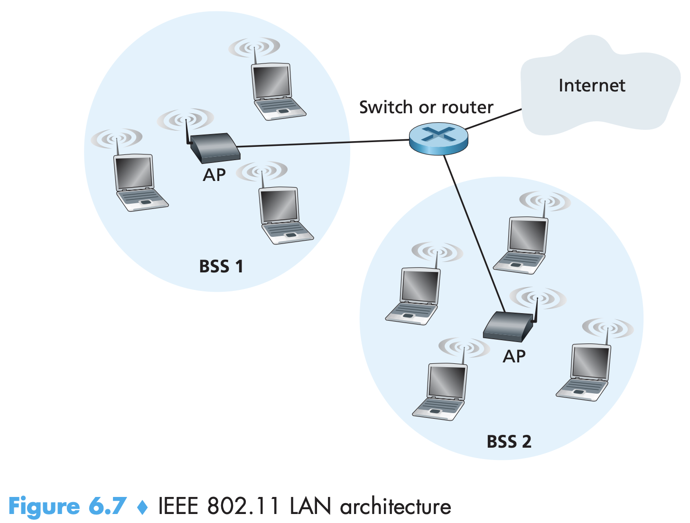

- The stations (laptops here) can also group themselves together to form an ad hoc network—a network with no central control and with no connections to the “outside world.” Here, the network is formed on the fly by mobile devices that have found themselves in proximity to each other, and want to communicate, and that find no preexisting network infrastructure (such as a centralized AP) in their location.

**Channels and Association**

- When a network administrator installs an AP, the administrator assigns a one- or two-word **Service Set Identifier (SSID)** to it along with a channel number. 802.11 defines 11 partially overlapping channels. Any two channels are non-overlapping if and only if they are separated by four or more channels. In particular, the set of channels 1, 6, and 11 is the only set of three non-overlapping channels. This means that an administrator could create a wireless LAN with an aggregate maximum transmission rate of 33 Mbps by installing three 802.11b APs at the same physical location, assigning channels 1, 6, and 11 to the APs, and interconnecting each of the APs with a switch.
- **WiFi jungle** is any physical location where a wireless station receives a sufficiently strong signal from two or more APs. Each of these APs would likely be located in a different IP subnet and would have been independently assigned a channel. To gain Internet access, your wireless station needs to join exactly one of the subnets and hence needs to **associate** with exactly one of the APs. Associating means the wireless station creates a virtual wire between itself and the AP. Frames are sent to and fro only to the associated AP.  The 802.11 standard requires that an AP periodically send **beacon frames**, each of which includes the AP’s SSID and MAC address. Your wireless station, knowing that APs are sending out beacon frames, scans the 11 channels, seeking beacon frames from any APs that may be out there.  The process of scanning channels and listening for beacon frames is known as **passive scanning**. A wireless host can also perform **active scanning**, by broadcasting a probe frame that will be received by all APs within the wireless host’s range.
- After selecting the AP with which to associate, the wireless host sends an association request frame to the AP, and the AP responds with an association response frame. Once associated with an AP, the host will want to join the subnet (in the IP addressing sense of Section 4.4.2) to which the AP belongs. Thus, the host will typically send a DHCP discovery message into the subnet via the AP in order to obtain an IP address on the subnet.
- The wireless station may be required to authenticate itself to the AP to form an association. This can happen through permission based on MAC address or passwords.

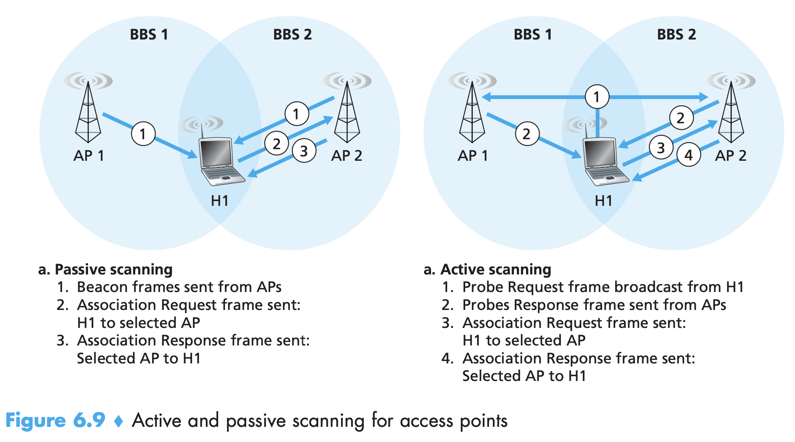

**802.11 MAC protocol**

- Multiple stations may want to transmit data frames at the same time over the same channel, so a multiple access protocol is needed to coordinate the transmissions. Here, a **station** is either a wireless station or an AP.
- A random access protocol called **CSMA/CA** is used in 802.11. CA stands for **collision avoidance**. Second difference with Ethernet protocol is that 802.11 uses a link-layer acknowledgment/retransmission (ARQ) scheme because of the relatively high bit error rates of wireless channels
- 802.11 does not do collision detection because ability to detect collisions requires the ability to send (the station’s own signal) and receive (to determine whether another station is also transmitting) at the same time. The strength of the received signal is typically very small compared to the strength of the transmitted signal at the 802.11 adapter, so it is costly to build hardware that can detect a collision. Even if it could send and receive at the same time, the adapter would still not be able to detect all collisions, due to the **hidden terminal problem and fading**.
- Thus, instead of aborting transmission when collision is detected, once a station begins to transmit a frame, *it transmits the frame in its entirety*
- The **link layer ACK scheme:
1.** When the destination station receives a frame that **passes the CRC**, it waits a short period of time known as the **Short Inter-frame Spacing (SIFS)** and then sends back an acknowledgment frame. If a sender senses the channel idle, it transmits its frame after a short period of time known as the **Distributed Inter-frame Space (DIFS).
2.** Otherwise, the station chooses a random backoff value using binary exponential backoff and counts down this value when the channel is sensed idle. While the channel is sensed busy, the counter value remains frozen.
3. When the counter reaches zero (note that this can only occur while the channel is sensed idle), the station transmits the entire frame and then waits for an acknowledgment.
4. If the acknowledgment isn’t received, the transmitting station reenters the backoff phase in step 2, with the random value chosen from a larger interval. If it is still not received after some fixed number of retransmissions, the transmitting station gives up and discards the frame.
- CSMA/CA **waits** when it senses the channel to be idle **instead of transmitting directly like CSMA/CD.** This is because in CSMA/CD if 2 waiting stations start transmission at the same time they can detect collision and abort. 802.11 cannot abort so it wants to avoid a costly collision. Collisions can still occur between 2 stations if random backoff values chosen that are close enough that the transmission from the station starting first have yet to reach the second station, or if they are **hidden** from each other. (take ex. of two stations waiting to transmit and a third one already transmitting)

**Dealing with Hidden Terminals: RTS and CTS**

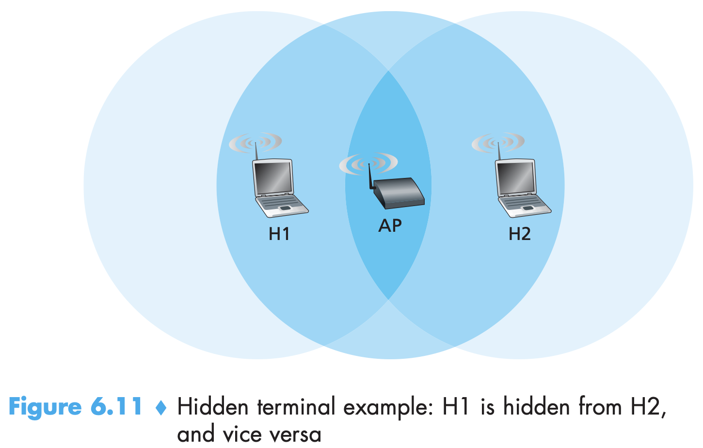

- Due to **fading**, signals of wireless stations can be limited to a range as shown. Collisions can happen here (which are costly because frame transmissions from both stations are done *completely*).
- IEEE 802.11 protocol allows a station to use a short **Request to Send (RTS)** control frame and a short **Clear to Send (CTS)** control frame to *reserve* access to the channel. This reservation scheme is *optional*.
- When a sender wants to send a DATA frame, it can first send an RTS frame to the AP, indicating the total time required to transmit the DATA frame and ACK frame. When the AP receives the RTS frame, it responds by broadcasting a CTS frame serving two purposes: It gives the sender explicit permission to send and also instructs the other stations not to send for the reserved duration.
- **Pros:**

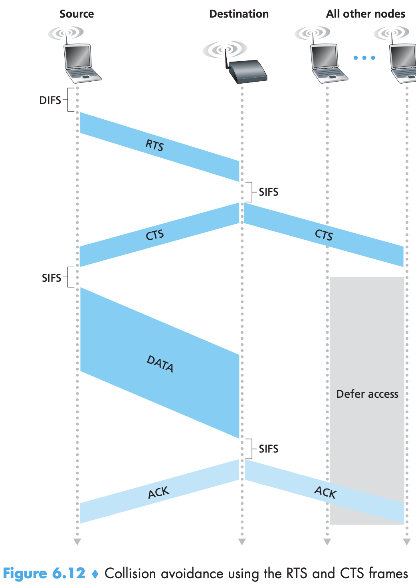

- **Pros and uses:
1.** The hidden station problem is mitigated, since a long DATA frame is transmitted only after the channel has been reserved.
2. Because the RTS and CTS frames are short, a collision involving an RTS or CTS frame will last only for the duration of the short RTS or CTS frame. Once the RTS and CTS frames are correctly transmitted, the following DATA and ACK frames should be transmitted without collisions.

Although the RTS/CTS exchange can help reduce collisions, it also introduces delay and consumes channel resources. So the RTS/CTS exchange is only used (if at all) to reserve the channel for the transmission of a long DATA frame. In practice, each wireless station can set an RTS threshold such that the RTS/CTS sequence is used only when the frame is longer than the threshold. 

For many wireless stations, the default RTS threshold value is larger than the maximum frame length, so the RTS/CTS sequence is skipped for all DATA frames sent.
- Instead of multiple access setting, if two nodes each have a directional antenna, they can point their directional antennas at each other and run the 802.11 protocol over what is essentially a point-to-point link. Use of directional antennas and an increased transmission power allow 802.11 to
be used as an inexpensive means of providing wireless point-to-point connections over tens of kilometers distance as cost of commodity 802.11 hardware is low.

## Chapter 7: Multimedia Networking

- Multimedia application can be classified as either *streaming stored audio/video*, *conversational voice/video-over-IP*, or *streaming live audio/video*.

### Multimedia Networking Applications

- Multimedia networking application is any application that employs audio or video
- **Video: 
1.** Most salient feature is its **high bit rate**. 
2. Video can be compressed - trading video quality with bit rate. Video is a collection of images which have pixels encoded into bits to represent luminance and color. Two types of redundancy in video which can be exploited by compression: **spatial redundancy** (within a given image - such as a lot of white space) and **temporal redundancy** (repetition between images).

We can also use compression to create **multiple versions** of the same video, each at a different quality level. The video in a video conference application can be compressed “on-the-fly” to provide the best video quality given the available end-to-end bandwidth between conversing users.
- **Audio:** 
has to first be converted from analog to digital. Following procedure is **pulse code modulation (PCM):**
1. Audio is sampled at a fixed rate. 
2. **Quantization:** Each of the samples is then rounded to one of a finite number of values - typically a power of two.
3. Each of the quantization values is represented by a fixed number of bits. The bit representations of all the samples are then concatenated together to form the digital representation of the signal. - signal sampled at 8000 samples per second and represented using 8 bits has rate of 64,000 bits per second.
The sampled audio is an approximation and will see a drop in quality (such as high freq missing). Decoded signal can perform a better approximation by increasing the sampling rate and number of quantization values. 

Thus (as with video), there is a trade-off between the quality of the decoded signal and the bit-rate and storage requirements of the digital signal.

**1.** Digital audio (including digitized speech and music) has significantly lower bandwidth requirements than video. 
2. PCM encoded speech and music is rarely used in the Internet. Compression techniques are used to reduce the bit rate of the stream. CD uses PCM. A popular compression technique for near CD-quality stereo music is **MPEG 1 layer 3 - MP3.** MP3 encoders can compress to many different rates. A related standard is **Advanced Audio Coding (AAC).** 

As with video, multiple versions of a prerecorded audio stream can be created, each at a different bit rate. Although audio bit rates are generally much less than those of video, users are much more sensitive to audio glitches than video glitches.

**Types of Multimedia Networking Applications**

**1. Streaming Stored Audio and Video.**   **2. Conversational Voice- and Video-over-IP** (see sections for brief)

3. **Streaming Live Audio and Video**

- Similar to traditional broadcast radio and television, except that transmission takes place over the Internet. - have many users receiving the audio/video at the same time.
- Although the distribution of live audio/video to many receivers can be efficiently accomplished using the IP multicasting techniques described in Section 4.7, multicast distribution is more often accomplished today via application-layer multicast (using P2P networks or CDNs) or through multiple separate unicast streams.
- Similar to streaming stored multimedia, average throughput must be ≥ video consumption rate for each live flow.
- Delay can also be an issue, although the timing constraints are much less stringent than those for conversational voice. 10s delay is fine.
- Many of the techniques used for streaming live media—initial buffering delay, adaptive bandwidth use, and CDN distribution—are similar to those for streaming stored media.

### Streaming Stored Video

- Underlying medium is prerecorded video/audio. Clients send requests to the servers to view the videos *on demand.*
- Has three key features:
1. **Streaming:** Client typically begins video playout within a few seconds after it begins receiving the video from the server. This means that the client will be playing out from one location in the video while at the same time receiving later parts of the video from the server. This technique, known as **streaming**, avoids having to download the entire video file (and incurring a potentially long delay) before playout begins.
2. **Interactivity:** Client must be able to pause, reposition fwd, bckwd, fast-forward etc. Time between request and action should be a few sec.
3. **Continuous playout:** Once playout of the video begins, it should proceed according to the original timing of the recording ⇒ data must be received from the server in time for its playout at the client. Otherwise, users experience video **frame freezing** (when the client waits for the delayed frames) or **frame skipping** (when the client skips over delayed frames).
- Most important performance measure for streaming video is **average throughput** must be ≥ bit rate of video.  Using **buffering** and **prefetching**, it
is possible to provide continuous playout even when the throughput fluctuates, as long as the average throughput (averaged over 5–10 seconds) remains above the video rate.
- For many streaming video applications, prerecorded video is stored on, and streamed from, a CDN rather than from a single data center. There are also many P2P video streaming applications for which the video is stored on users’ hosts (peers).

*end of brief*

- Streaming video systems can be classified into three categories: **UDP streaming**, **HTTP streaming**, and **adaptive HTTP streaming**. Last two are most commonly used.
- A common characteristic of all three forms of video streaming is the extensive use of **client-side application buffering** to mitigate the effects of varying end-to-end delays and varying amounts of available bandwidth between server and client. Two advantages as long as client appl buffer is not exhausted:
1. Absorbs variations in server-to-client delay
2. If server-to-client bandwidth briefly drops below the video consumption rate, user can continue to enjoy continuous playback

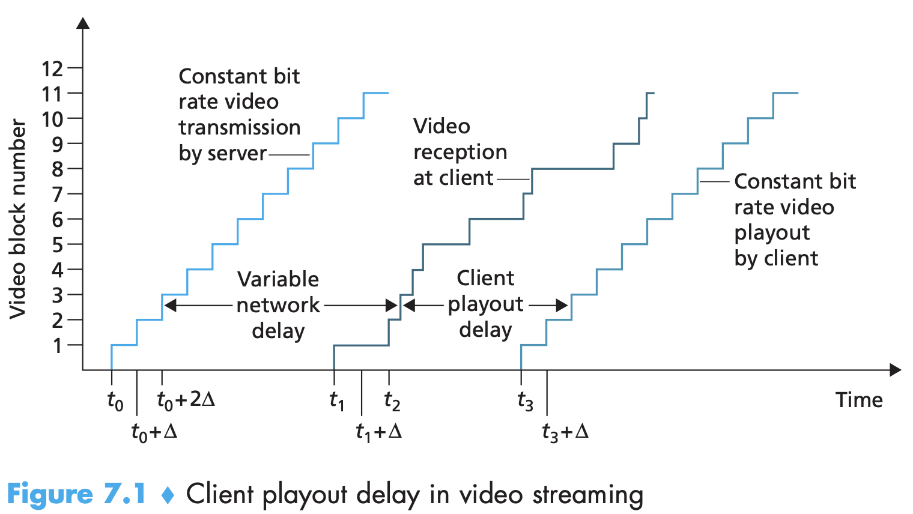

**UDP Streaming**

- UDP has no congestion control mechanism, so the server transmits video at a rate that matches the client’s video consumption rate by clocking out the video chunks over UDP at a steady rate. 8000 bits of video per UDP packet/2Mbps video consumption rate = 4msec per packet.
- Uses a small client-side buffer, big enough to hold less than a second of video.
- Before passing the video chunks to UDP, the server encapsulates the chunks within transport packets specially designed for transporting audio and video, using the **Real-Time Transport Protocol (RTP).**
- Client and server also maintain, in parallel, a separate control connection over which the client sends commands regarding session state changes
(such as pause, resume, reposition, and so on) - analogous to FTP control connections. **Real-Time Streaming Protocol (RTSP)** is a popular open protocol.
- Several drawbacks:
1. Due to  unpredictable and varying amount of available bandwidth between server and client, constant-rate UDP streaming can fail to provide continuous playout whenever available bancdwidth drops below video consumption rate for several secs - with freezing or skipped frames
2. It requires a media control server, such as an RTSP server, to process client-to-server interactivity requests and to track client state for *each* ongoing client session. This increases the overall cost and complexity of deploying a large-scale video-on-demand system. 
3. Many firewalls are configured to block UDP traffic, preventing the users behind these firewalls from receiving UDP video.

**HTTP Streaming**

- Video is simply stored in an HTTP server as an ordinary file with a specific URL. Client issues HTTP GET request to view. Once the number of bytes the client appl buffer exceeds a predetermined threshold, the client application begins playback—specifically, it periodically grabs video frames from the client application buffer, decompresses the frames, and displays them on the user’s screen.
- TCP’s congestion control and reliable-data transfer mechanisms - which can cause transmission delays - do not necessarily preclude continuous playout when **client buffering** and **prefetching** are used.
- Use of HTTP over TCP also allows the video to traverse firewalls and NATs more easily (they allow most HTTP traffic)
- Streaming over HTTP also obviates the need for a media control server such as an RTSP server, reducing the cost of a large-scale deployment over the Internet.
- For streaming *stored* video, the client can attempt to download the video at a rate *higher* than the consumption rate, thereby **prefetching** video frames that are to be consumed in the future. Prefetching occurs naturally with TCP streaming, since TCP’s congestion avoidance mechanism will attempt to use all of the available bandwidth between server and client.
- After “passing through the socket door,” the bytes are placed in the TCP **send buffer (??)** before being transmitted into the Internet. Client application (media player) reads bytes from the **TCP receive buffer** (through its client socket) and places the bytes into the **client application buffer** (they’re different).
- When the client application removes *f* bits, it creates room for *f* bits in the client application buffer, which in turn allows the server to send *f* additional bits. Thus, the **server send rate ≤ video consumption rate at the client**. Therefore, *a full client application buffer indirectly imposes a limit on the rate that video can be sent from server to client when streaming over HTTP.*
- **video consumption rate in bits/s = frame rate x no. of bits in a frame** evidently
- *When the available rate in the network < video rate, playout will alternate between periods of continuous playout and periods of freezing.* User will enjoy continuous playout otherwise.
- HTTP streaming systems often make use of the **HTTP byte-range header** in the HTTP GET request message, which specifies the specific range of bytes the client currently wants to retrieve from the desired video. Useful when the user wants to reposition (jump) to a future point in time in the video.
- For repositioning or early termination, prefetched-but-not-yet-viewed data transmitted by the server will go unwatched—a waste of network bandwidth and server resources. There is significant wasted bandwidth in the Internet due to early termination, which can be quite costly, particularly for wireless links. So many streaming systems use only a **moderate-size** client application buffer, or will **limit the amount of prefetched video using the byte-range header** in HTTP requests.

### Voice-over-IP

- Real-time conversational voice over the Internet is referred to as **Internet telephony/Voice-over-IP (VoIP).**
- **Timing considerations** and **tolerance of data loss** are particularly important for conversational voice and video applications. Clearly different from those of elastic data applications such as Web browsing, e-mail, social networks, and remote login - where timing loss is okay but completeness and integrity of data is very important.
- Timing considerations are important because audio and video conversational applications are highly **delay-sensitive** - must be ≤ few 100 ms. For voice, delays < 150 ms are not perceived by a human listener, delays between 150-400 ms can be acceptable.
- Conversational multimedia applications are **loss-tolerant -** occasional loss only causes occasional glitches in audio/video playback, and these losses can often be partially or fully concealed.
- Conversational video is very similar to this.

*end of brief*

**Limitations of best effort IP service**

- IP does not provide guarantees on delay or percentage of lost packets. This is challenging to real time conversational applications which are sensitive to **packet delay, jitter**, and **loss**. **Application layer techniques** are discussed here.
- Sender generates bytes at a rate of 8,000 bytes/sec; every 20 msecs the sender gathers these bytes into a **chunk**. A chunk and a special header are encapsulated in a UDP segment, via a call to the socket interface. Thus, the number of bytes in a chunk is (20 msecs)·(8,000 bytes/sec) = 160 bytes, and a UDP segment is sent every 20 msecs - example used
- Some packets can be lost and most packets will not have the same end-to-end delay, even in a lightly congested Internet. So the receiver must take care in determining (1) **when to play back a chunk**, and (2) **what to do with a missing chunk.**
- **Packet loss** can happen in UDP (suppose router buffer is full). 

TCP cannot be used because retransmission mechanisms are often considered unacceptable because they increase end-end delay. Due to TCP congestion control, packet loss may result in a reduction of the TCP sender’s transmission rate to a rate < receiver’s drain rate, possibly leading to buffer starvation. This can have a severe impact on voice intelligibility at the receiver.

Most conversational real time voice appls use UDP by default. Switch to TCP if user is behind firewall. Packet loss rates between **1-20%** can be tolerated, depending on how voice is encoded and transmitted, and on how the loss is concealed at the receiver. For example, **forward error correction (FEC)** can help conceal packet loss. With FEC, **redundant information** is transmitted along with the original information so that some of the lost original data can be recovered from the redundant information. If more than 1 links between sender and receiver is severely congested, and packet loss exceeds **10 to 20 percent** (for example, on a wireless link), then there is really **nothing that can be done** to achieve acceptable audio quality. Clearly, best-effort service has its limitations.
- **End-to-end Delay**: is the accumulation of transmission, processing, and queuing delays in routers; propagation delays in links; and end-system processing delays. Timing considerations are important because audio and video conversational applications are highly **delay-sensitive** - must be ≤ few 100 ms. For voice, delays < 150 ms are not perceived by a human listener, delays between 150-400 ms can be acceptable. The receiving side of a VoIP application will typically disregard any packets that are delayed more than a certain threshold, for example, more than 400 msecs. Thus, packets that are delayed by more than the threshold are effectively lost.
- **Packet jitter**: Because of varying queuing delays at the various routers, the time from when a packet is generated at the source until it is received at the receiver can fluctuate from packet to packet. This phenomenon is called **jitter**. Sending time and receiving time between two packets can change. Spacing can also become *less* at the receiver if the time it takes to transmit a packet on the router’s outbound link is less than time it took at sender! 

Audio becomes unintelligible if receiver starts playing chunks by ignoring jitters. Jitters can often be removed by using **sequence numbers**, **timestamps**, and a **playout delay.**

**Removing jitter at receiver for audio**

- Two mechanisms are combined: 

*1. Prepending each chunk with a **timestamp.*** The sender stamps each chunk with the time at which the chunk was generated.
2. ***Delaying playout** of chunks at the receiver*. The playout delay of the received audio chunks must be long enough so that most of the packets are received before their scheduled playout times. This playout delay can either be fixed throughout the duration of the audio session or vary adaptively during the audio session lifetime.

Two playback strategies: **fixed playout delay** and **adaptive playout delay.**

     **Fixed playout delay:** 

- With the fixed-delay strategy, the receiver attempts to play out each chunk exactly *q* msecs after the chunk is **generated** (at sender!). So if a chunk is timestamped at the sender at time *t,* the receiver plays out the chunk at time *t* + *q,* assuming the chunk has arrived by that time. Packets that arrive after their scheduled playout times are discarded and considered lost.
- VoIP can support delays up to about 400 msecs, although a more satisfying conversational experience is achieved with smaller values of *q*. On the other hand, if *q* is made much smaller than 400 msecs, then many packets may miss their scheduled playback times due to the network-induced packet jitter.

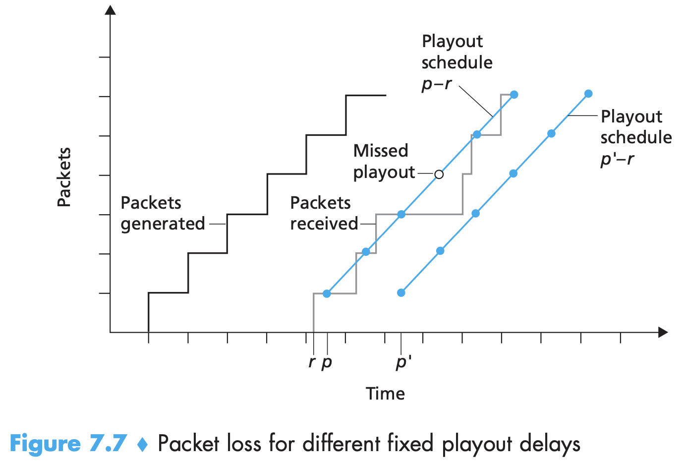

- Roughly speaking, if large variations in end-to-end delay are typical, it is preferable to use a large *q*; on the other hand, if delay is small and variations in delay are also small, it is preferable to use a small *q,* perhaps less than 150 msecs.

    **Adaptive playout delay**

- For conversational services such as VoIP, long delays can become bothersome if not intolerable. So, estimate the network delay and
the variance of the network delay, and to adjust the playout delay accordingly at the **beginning** of each talk spurt.
- This adaptive adjustment of playout delays at the beginning of the talk spurts will cause the sender’s silent periods to be compressed and elongated; however, compression and elongation of silence by a small amount is not noticeable in speech.
- Let ti=time of packet generation, ri=receiving time, pi=playing time at receiver.
**average network delay** $d_i = (1-u)d_{i-1}+u(r_i-t_i)$ - more weight on recently observed network delay
avg deviation of delay $v_i = (1-u)v_{i-1}+u|r_i-t_i-d_i|$
- used only to determine the playout point for the first packet in any talk spurt.

$p_i$ for first packet of a talk spurt $= t_i+d_i+Kv_i$
The purpose of the *Kvi* term is to set the playout time far enough into the future so that only a small fraction of the arriving packets in the talk spurt will be lost due to late arrivals. The playout point for any subsequent packet in a talk spurt is computed as an offset from the point in time when the first packet in the talk spurt was played out.
Find $q_i = p_i-t_i$, then for each $p_j$ in talk spurt $p_j = t_j + q_i$

First packet in a spurt can be detected by examining the signal energy in each received packet.

**Recovering from packet loss**

- **Loss recovery schemes** attempt to preserve audio quality in the face of packet loss. Loss is either no arrival or arrival **after** playout time.
- Retransmission will have delay and is useless if done after playout time. Instead, loss anticipation schemes like **forward error correction (FEC)** and **interleaving** are employed.
- **Forward Error Correction (FEC):** add redundant information to the original packet stream at the cost of marginally increasing transmission rate. The redundant information can be used to reconstruct approximations or exact versions of some of the lost packets.
1. Send a redundant encoded chunk after every n chunks by XORing them. Only one lost packet can be reconstructed. Obviously: By keeping *n* + 1, the group size, small, a large fraction of the lost packets can be recovered when loss is not excessive. However, the smaller the group size, the greater the relative increase of the transmission rate.

2. Send a lower-resolution audio stream as the redundant information. A stream of mostly high-quality chunks, occasional low-quality chunks, and no missing chunks gives good overall audio quality. Note that in this scheme, the receiver only has to receive two packets before playback, so that the increased playout delay is small. If low-bit encoding is << nominal encoding then inc in transmission rate is small.

In order to cope with consecutive loss, we can use a simple variation. Instead of appending just the (*n* – 1)st low-bit rate chunk to the *n*th nominal chunk. Appending more such chunks makes audio quality at the receiver becomes acceptable for a wider variety of harsh best-effort environments at the cost of tr bandwidth and playout delay

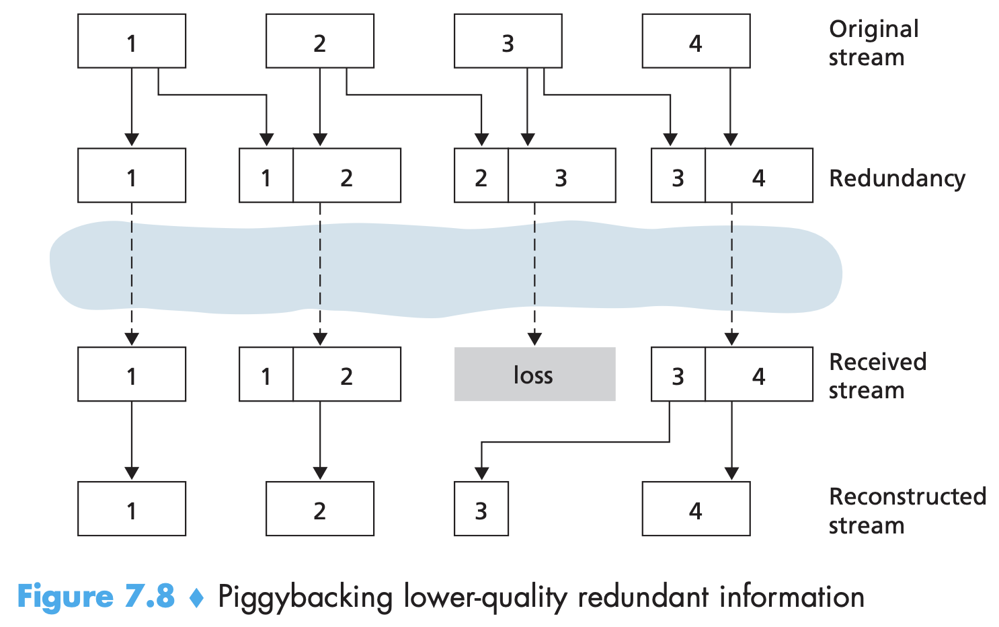

- **Interleaving:** Instead of redundant transmission, sender can interleave! ie., resequence units of audio data before transmission, so that originally adjacent units are separated by a certain distance in the transmitted stream. Interleaving can mitigate the effect of packet losses. Loss of a single packet from an interleaved stream results in multiple small gaps in the reconstructed stream, as opposed to the single large gap that would occur in a noninterleaved stream. 

Interleaving improves audio quality, has low overhead, does not increase the bandwidth requirements of a stream but increases latency. So it is good for streaming stored audio but limited for VoIP.

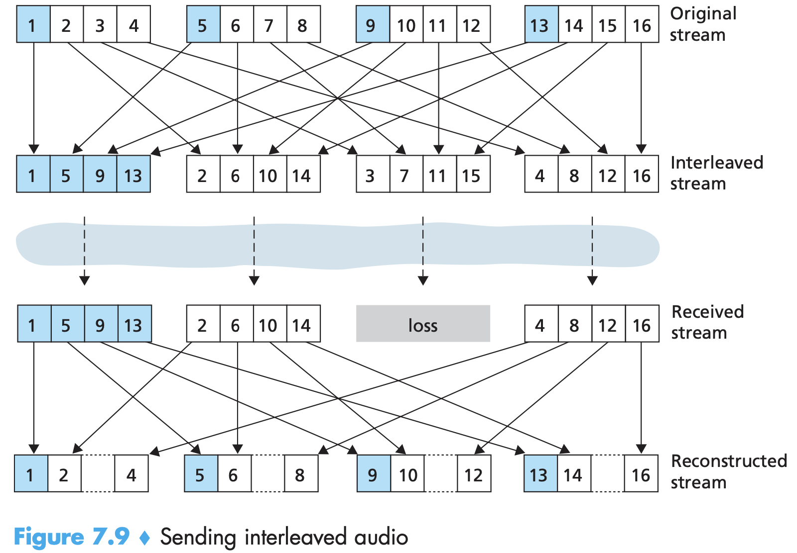

- **Error concealment** schemes attempt to produce a replacement for a lost packet that is similar to the original.  possible since audio signals, and in particular speech, exhibit large amounts of short-term self-similarity. When the loss length approaches the length of a phoneme (5–100 msecs) these techniques break down, since whole phonemes may be missed by the listener. **Packet repetition** and **interpolation** (more computationally intensive and better) are common techniques.

### Protocols for real time conversational applications (only RTP)

- Sender side of a VoIP application appends header fields to the audio chunks before passing them to the transport layer. RTP can be used for transporting PCM, ACC, and MP3 for sound and MPEG and H.263 for video. It can also be used for transporting proprietary sound and video formats.
- RTP runs on top of UDP. The sending side encapsulates a media chunk within an RTP packet, then encapsulates the packet in a UDP segment, and then hands the segment to IP. Receiving side does de encapsulation. Encapsulation is thus only seen at end systems. Application layer extracts media chunk from RTP packet. Routers do not distinguish between IP datagrams that carry RTP packets and IP datagrams that don’t.

Appl collects encoded data into chunk. Each chunk of audio data is preceded with an **RTP header**. The audio chunk along with the RTP header form the **RTP packet**.

An application incorporating RTP instead of proprietary schemes can more easily interoperate with other networking multimedia applications.  RTP allows each source (eg., video (camera) and audio (mic)) to be assigned its own independent RTP stream of packets. Many popular encoding techniques—including MPEG 1 and MPEG 2—bundle the audio and video into a single stream leading to a single RTP stream.

RTP packets can be sent over unicast, one-to-many and many-to-many multicast trees. All of the session’s senders and sources typically use the same multicast group for sending their RTP streams. RTP multicast streams belonging together, such as audio and video streams emanating from multiple senders in a video conference application, belong to an **RTP session**. 

RTP runs on UDP - so it does not provide any mechanism to ensure timely delivery of data or provide other quality-of-service (QoS) guarantees; it  does not even guarantee delivery of packets or prevent out-of-order delivery of packets.
- **Four** main header fields:
**1. Payload type:** 7 bits long. Specifies audio/video format (type of audio/video encoding). Sender may want to change the encoding in order to increase the audio quality or to decrease the RTP stream bit rate. Sender can change encoding on the fly during a session and inform receiver through this payload field.
**2. Sequence number field:** 16 bits long. Increments by 1 for each RTP packet sent. Can be used by receiver to detect packet loss and to restore packet sequence (maybe attempt to *conceal* the lost data)
**3. Timestamp:** 32 bits long. Reflects the sampling instant of the first byte in the RTP data packet. Receiver can use timestamps to remove packet jitter, as seen. The timestamp is derived from a sampling clock at the sender. As an example, for audio the timestamp clock increments by one for each sampling period (for example, each 125 sec for an 8 kHz sampling clock); if the audio application generates chunks consisting of 160 encoded samples, then the timestamp increases by 160 for each RTP packet when the source is active. Timestamp clock continues to increase at a constant rate even if the source is inactive. 
**4. Synchronization source identifier (SSRC):** 32 bits long. Identifies the source of the RTP stream. Typically, each stream in an RTP session has a distinct SSRC. The SSRC ≠ IP address of the sender, but is a randomly assigned by the source when the new stream is started. The
probability that two streams get assigned the same SSRC is very small. If it does, the two sources pick a new SSRC value.

### Network Support for Multimedia

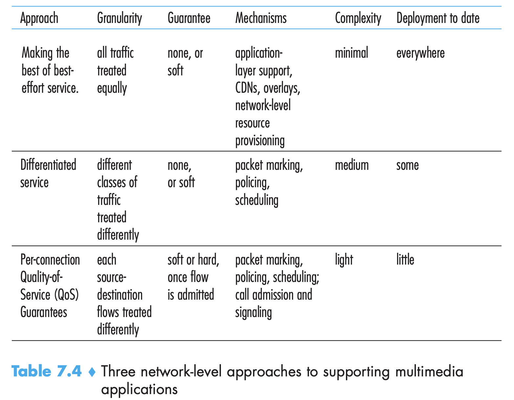

**Dimensioning best-effort networks**

- Difficulty in supporting multimedia applications arises from their stringent performance requirements––low end-to-end packet delay, delayj itter, and loss - and their occurrence whenever the network is congested.
- “Throw money at the problem” - When demand increases are forecasted, the ISPs deploy additional bandwidth and switching capacity to continue to ensure satisfactory delay and packet-loss performance.
 Providing enough link capacity throughout the network so that network congestion, and its consequent packet delay and loss, never (or only very rarely) occurs. How much capacity? What is its cost?
- The question of how much capacity to provide at network links in a given topology to achieve a given level of performance is known as **bandwidth provisioning**. The even more complicated problem of how to design a network topology (where to place routers, how to interconnect routers with links, and what capacity to assign to links) to achieve a given level of end-to-end performance is a network design problem often referred to as **network dimensioning**. Needs to address **3** issues:

1. *Models of traffic demand between network end points* - at both call level (users arriving) and packet level
2. *Well-defined performance requirements* - for delay sensitive traffic, this can mean that Pr(e2e delay > max. tolerable delay) is very small
3. *Models to predict end-to-end performance for a given workload model, and techniques to find a minimal cost bandwidth allocation that will result in all user requirements being met.-* quantify performance for a given workload, optimization techniques to find minimal-cost bandwidth allocations meeting performance requirements. 

The reason this is not done despite being possible is economic (costly) and organizational (e2e path for multimedia can pass through a network of multiple ISPs. Would these ISPs be willing to cooperate (perhaps with revenue sharing) to ensure that the end-to-end path is properly dimensioned to support multimedia applications?

**Providing multiple classes of service**

- With **differentiated service**, one type of traffic might be given strict priority over another types when both types of traffic are queued at a router. (eg., packets of a real-time conversational application > other packets, due to their stringent delay constraints). Requires new mechanisms for packet marking (indicating a packet’s class of service), packet scheduling, and more.
- ISPs can charge more for these “higher” tiers of service. By dealing with a small number of traffic aggregates, rather than a large number of individual connections, the new network mechanisms required to provide better-than-best service can be kept relatively simple.
- Notion kind of exists through the  **type of service (ToS)** field in **IPv4** **header**. Was present in an ancestor of this as well.

**Motivation**

- **Insight 1: Packet marking** allows a router to distinguish among packets belonging to different classes of traffic. (Router and landline ex)
- **Insight 2:** It is desirable to provide a degree of **traffic isolation** among classes so that one class is not adversely affected by another class of traffic that misbehaves. (Audio packets overcrowding, competition between packets of similar classes etc.)
- **Two** broad approaches to **isolation**. → **1. Traffic policing** mechanism can be put into place to ensure that criteria that a traffic class/flow needs to meet are indeed observed. If the policed application misbehaves, the policing mechanism will take some action (for example, drop or delay packets that are in violation of the criteria) so that the traffic actually entering the network conforms to the criteria. **ex. leaky bucket.**
- Insight 1 (packet classification/marking) and Insight 2 (traffic policing) can be implemented together at the network’s edge, either in the end system or at an edge router.
- **Insight 3:** While providing isolation among classes or flows, it is desirable to use resources (for example, link bandwidth and buffers) as efficiently as possible. (ie., don’t do a circuit switching kind of thing where a traffic class can use only certain bandwidth even when other classes aren’t using)

**Scheduling mechanisms**

- **multiplexing:** a way of sending multiple signals or streams of information over a communications link at the same time in the form of a single, complex signal
- Packets belonging to various network flows are multiplexed and queued for transmission at the output buffers associated with a link. The manner in which queued packets are selected for transmission on the link is known as the **link-scheduling discipline**. Several exist:
1. **First-In-First-Out (FIFO):** aka **FCFS**
If there is not enough buffering space to hold the arriving packet, the queue’s **packet-discarding policy** determines whether the packet will be dropped (lost) or whether other packets will be removed from the queue to make space for the arriving packet. Packets leave in the same order that they arrived in.
2. **Priority Queuing:**
Packets arriving at the output link are classified into priority classes at the output queue. (Priority class can be ToS or other header, source/destination IP/port number etc.). Each priority class typically has its own queue. Highest nonempty priority queue is serviced first. Within a queue, FIFO. 

Under a nonpreemptive priority queuing discipline, the transmission of a packet is not interrupted once it has begun.
3. **Round Robin and Weighted Fair Queuing (WFQ):** 
Under the **round robin queuing discipline**, packets are sorted into classes as with priority queuing. However, rather than there being a strict priority of service among classes, a round robin scheduler alternates service among the classes. A **work-conserving round robin discipline** that looks for a packet of a given class but finds none will immediately check the next class in the round robin sequence.

A generalized abstraction of round robin queuing that has found considerable use in QoS architectures is the so-called **weighted fair queuing** (WFQ) discipline. It is also a work-conserving discipline, but differs from round robin in that class may receive a *differential* amount of service in any interval of time. Each class has a weight wi assigned. 

Under WFQ, during any interval of time during which there are class *i* packets to send, class *i* will then be guaranteed to receive a fraction of service equal to *wi*/(∑*wj*),.  In the worst case, even if all classes have queued packets, class *i* will still be guaranteed to receive a fraction *wi* /(∑*wj*) of the bandwidth.  Thus, for a link with transmission rate *R,* class *i* will always achieve a throughput of at least *R*· *wi*/(∑*wj*). WFQ plays a central role in QoS architectures. Is available in router products as well.

**Policing: The Leaky Bucket**

- **Three** policing criteria each differing from the other according to the time scale over which the packet flow is policed:
1. *Average rate.* The network may wish to limit the long-term average rate (packets per time interval) at which a flow’s packets can be sent into the network. Interval of time over which the average rate will be policed is important.  100 packets per second is more constrained than 6,000 packets per minute, even though both are the same over a long enough interval of time. ex, the latter constraint would allow a flow to send 1,000 packets in a given second-long interval of time, while the former constraint would disallow this sending behavior.
2. *Peak rate:* limits the maximum number of packets that can be sent over a shorter period of time. ex., average rate of 6,000 packets per minute, while limiting the flow’s peak rate to 1,500 packets per second.
3. *Burst size.* limit the maximum number of packets (the “burst” of packets) that can be sent into the network over an extremely short interval of time. Even though it is physically impossible to instantaneously send multiple packets into the network the abstraction of a maximum burst size is a useful one.

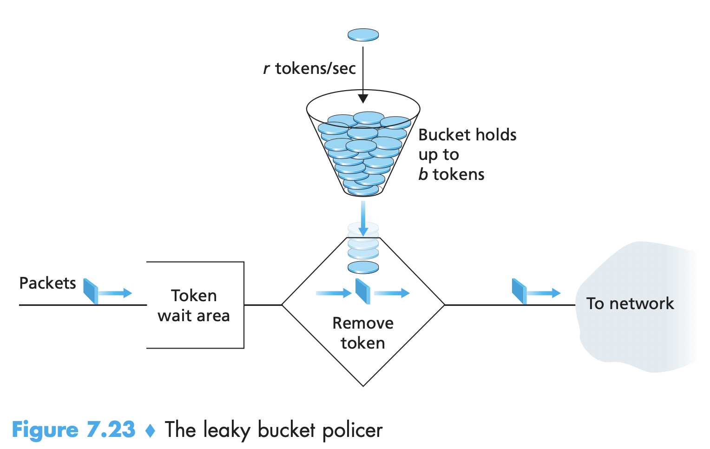

- Bucket can hold up to b tokens. Tokens are generated at rate r. If bucket is full then new tokens are ignored. Incoming packet must pick  token a move forward. Thus, the maximum burst size for a leaky-bucket policed flow is *b* packets. Because the token generation rate is *r,* the maximum number of packets that can enter the network of *any* interval of time of length *t* is *rt* + *b*. So *r* serves to limit the long-term average rate at which packets can enter the network. 
It is also possible to use leaky buckets (specifically, two leaky buckets in series) to **police a flow’s peak rate** in addition to the long term average rate.

**Leaky Bucket + Weighted Fair Queuing = Provable Maximum Delay in a Queue**

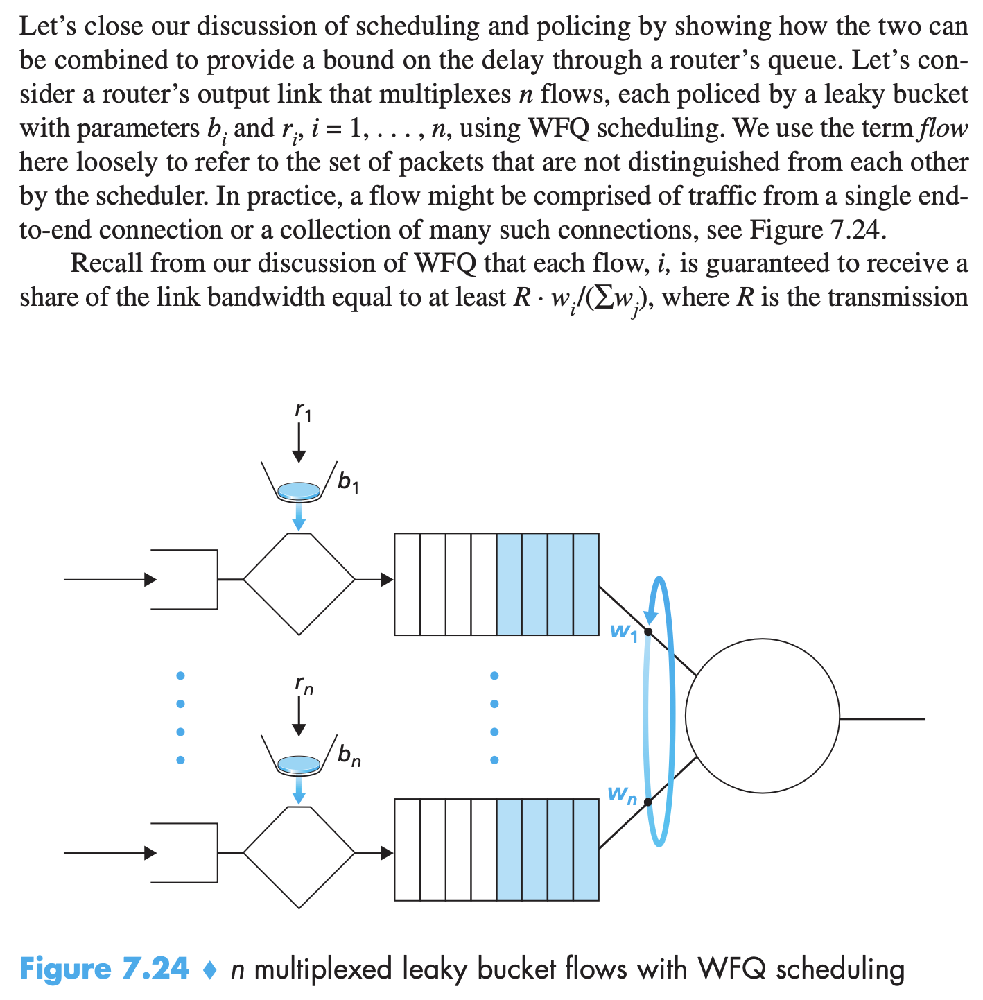

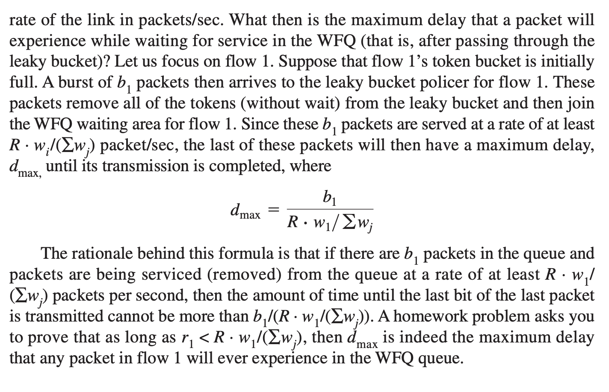

### Per-Connection QoS Guarantees: Resource reservation and Call Admission

- **Insight 4:** If sufficient resources will not always be available, and QoS is to be *guaranteed*, a call admission process is needed in which flows declare their QoS requirements and are then either admitted to the network (at the required QoS) or blocked from the network (if the required QoS cannot be provided by the network). - think about competing audio flows of 1Mbps for a 1.5Mbps link
- Process of having a flow declare its QoS requirement, and then having the network either accept the flow (at the required QoS) or block the flow is referred to as the **call admission** process.
- We need several new network mechanisms and protocols if an end-to-end flow is to be guaranteed a given quality of service once it begins:
1. **Resource reservation:** The only way to *guarantee* that a call will have the resources (link bandwidth, buffers) needed to meet its desired QoS.  Once resources are reserved, the call has on-demand access to these resources throughout its duration, regardless of the demands of all other calls. A call will receive loss- and delay-free performance if its transmission rate **never exceeds** guaranteed bandwidth.
2. **Call admission:** In telephone, **i**f the circuits (TDMA slots) needed to complete the call are available, the circuits are allocated and the call is completed. If the circuits are not available, then the call is blocked, and we receive a busy signal. Typically, a call may reserve only a fraction of the link’s bandwidth, and so a router may allocate link bandwidth to more than one call. Sum of the allocated bandwidth to all calls should be less than the link capacity if hard quality of service guarantees are to be provided. 
3. **Call setup signaling:** The call admission process described above requires that a call be able to reserve sufficient resources at each and every network router on its source-to-destination path to ensure that its end-to-end QoS requirement is met. Each router must determine the local resources required by the session, consider the amounts of its resources that are already committed to other ongoing sessions, and determine whether it has sufficient resources to satisfy the per-hop QoS requirement of the session at this router without violating local QoS guarantees made to an already-admitted session. A signaling protocol is needed to coordinate these various activities—the per-hop allocation of local resources, as well as the overall end-to-end decision of whether or not the call has been able to reserve sufficient resources at each and every router on the end-to-end path. This is the job of the **call setup protocol**, as shown in Figure 7.28. The **RSVP protocol** was proposed for this purpose within an Internet architecture for providing quality-of-service guarantees.

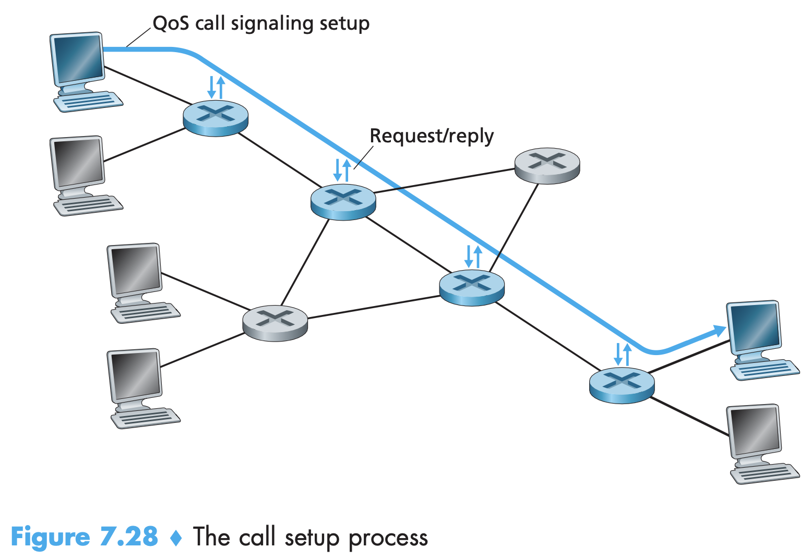

Despite a tremendous amount of research and development, and even products that provide for per-connection quality of service guarantees, there has been almost no extended deployment of such services. This may be because 
1. That the simple application-level mechanisms, combined with proper network dimensioning provide “good enough” best-effort network
service for multimedia applications. 
2. The added complexity and cost of deploying and managing a network that provides per-connection quality of service guarantees may be judged by ISPs to be simply too high given predicted customer revenues for that service.

# Tanenbaum Notes

### Telephone Network

- The limiting factor for networking purposes turns out to be the ‘‘last mile’’ over which customers connect, not the trunks and switches inside the telephone network. This situation is changing with the gradual rollout of fiber and digital technology at the edge of the network.
- Phone companies relied on **switching offices** to maintain their networks and connect callers. Each telephone has two wires that connect to the company’s nearest **end office** (also called a **local central office**). These wires are known as the **local loops**.
- Each end office has a number of outgoing lines to one or more nearby switching centers, called **toll offices** (or, if they are within the same local area - intra-LATA toll offices: **tandem offices**). These lines are called **toll connecting trunks**. The toll offices communicate with each other via high-bandwidth **intertoll trunks** (also called **interoffice trunks**).
- In the past, transmission throughout the telephone system was analog, with the actual voice signal being transmitted as an electrical voltage from source to destination. Now, only the local loop is analog, rest all is digital because it is not necessary to produce an accurate analog waveform. Telling 0 from 1 is enough.
- According to **MFJ (Modified Final Judgement)** US was divided into 164 **LATAs** (**Local Access and Transport Areas**). In each LATA, **LEC** (**Local Exchange Carrier**) had monopoly on traditional telephone service. All inter-LATA traffic was handled by an **IXC** (**Inter eXchange Carrier**). An IXC wishing to handle calls in a LATA has to build a **POP (Point of Presence)** there.
- The LEC is required to connect each IXC to every end office either directly or indirectly. Furthermore, the terms of the connection, both technical and financial, must be identical for all IXCs. This requirement enables, a subscriber in, say, LATA 1, to choose which IXC to use for calling subscribers in LATA 3.
- **local number portability** means that a customer can change local telephone companies without having to get a new telephone number.
- The core of the telephone network carries digital information, not analog. (Trunks - digital). Sharing of this trunk is done in TDM and FDM. Sharing is imp because high and low bandwidth require the same amount of money to install and maintain?
- TDM can be handled entirely by digital electronics, so it has become far more widespread in recent years. In **T1 carrier method** - 125usec (a frame) is divided into 24 channels (8 bits each) + 1 signaling bit (framing code - used for frame synchronisation and signaling). In one variation, the 193rd bit is used across a group of 24 frames called an **extended superframe.** 

Six bits (4,8,12,16,20,24) take on the alternating pattern 001011.. The receiver keeps checking for this pattern to make sure that it has not lost synchronization. Six more bits are used to send an error check code to help the receiver confirm that it is synchronized. If it does get out of sync, the receiver can scan for the pattern and validate the error check code to get resynchronized. The remaining 12 bits are used for control information for operating and maintaining the network, such as performance reporting from the remote end.
- Time division multiplexing allows multiple T1 carriers to be multiplexed into higher-order carriers.
    
    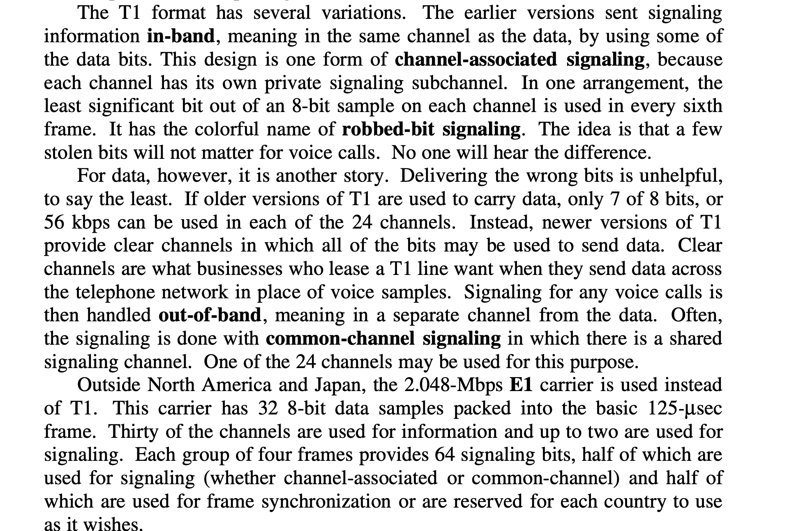
    
- 
    
    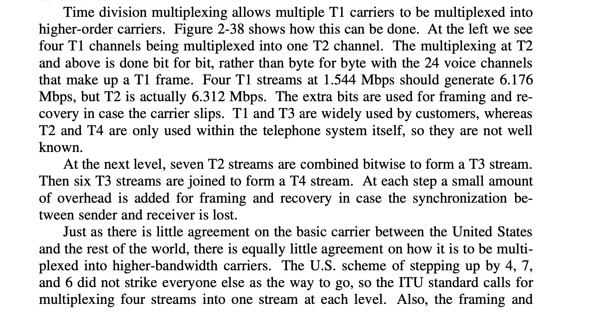
    
    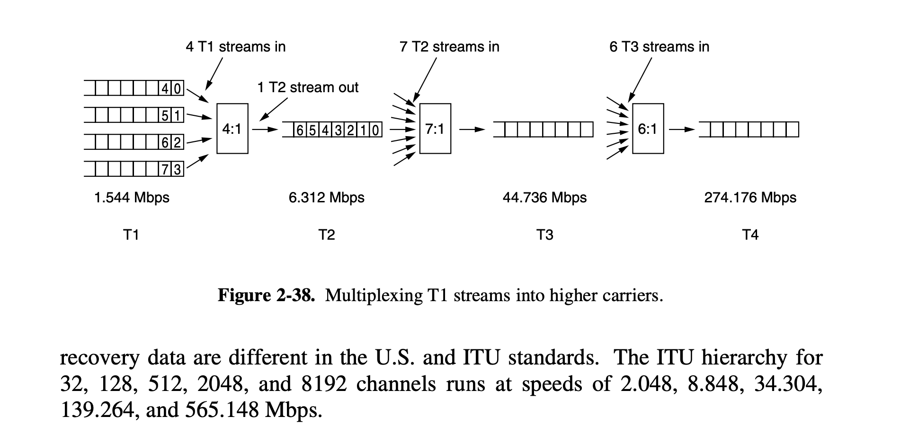
    
- For home users, ISPs usually charge a flat monthly rate because it is less work for them and their customers can understand this model, but backbone carriers charge regional networks based on the volume of their traffic.
    
    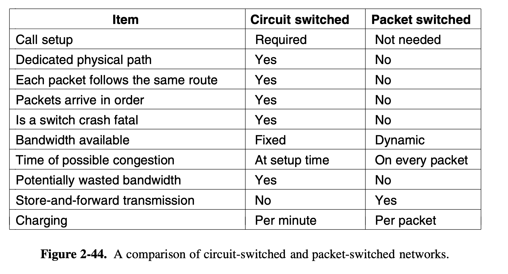
    
-